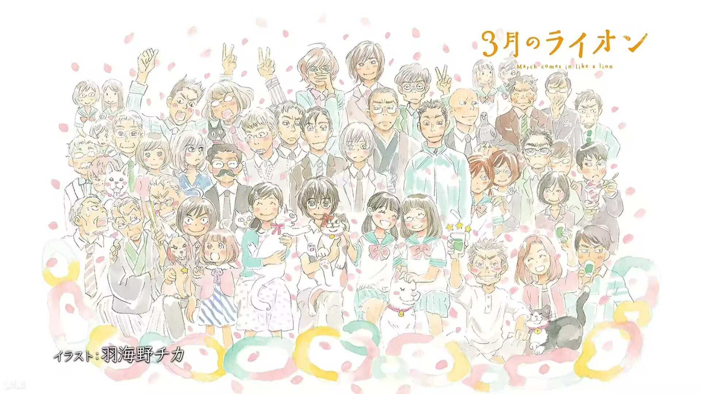
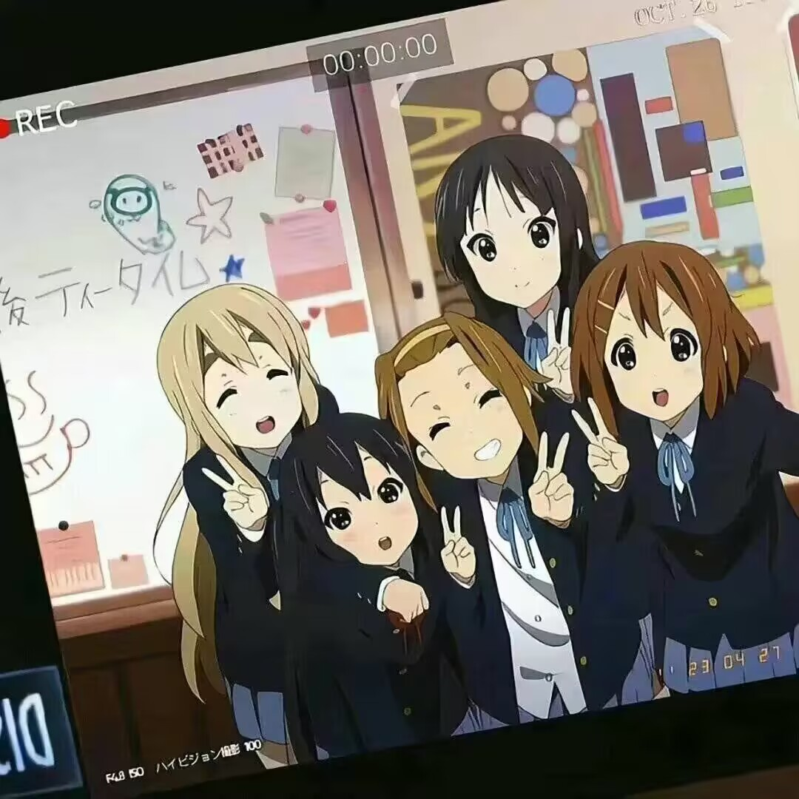
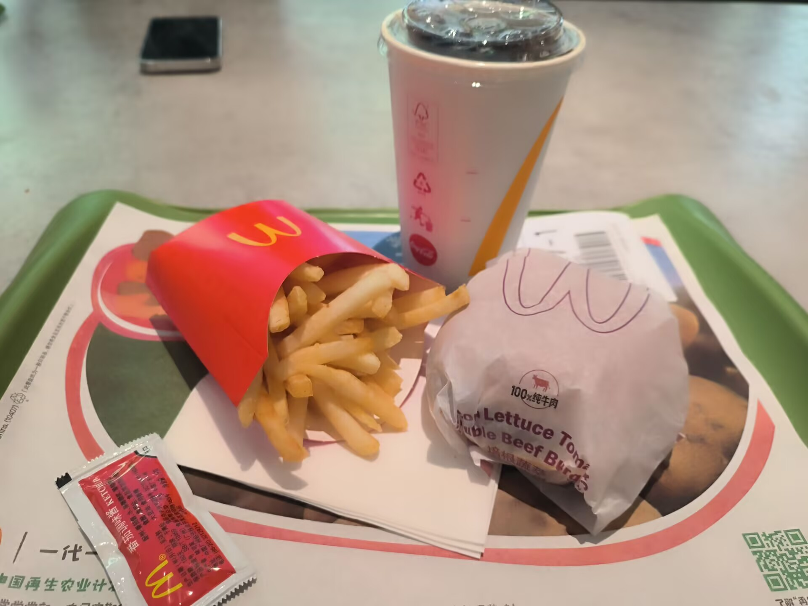
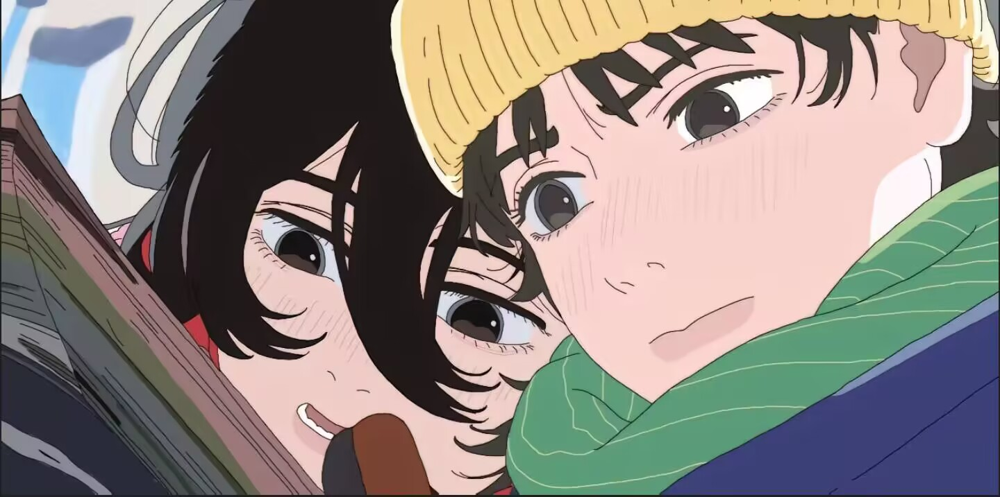

# 开篇

🎉2024年7月5日，是我将 blog 第一次部署在 github 上的日子

至于开发这个 blog 的确切目的🧶...

我想一方面是为了做些知识笔记、记录，然后就是人云亦云的跟风，做一些表达，抒发。养成一种记录的习惯想必也是极好的。

但是这一页多半只会是一些零零碎碎的记录📓....

## 2024/7/06

first day，努力努力再努力🔆

## 2024/7/08

《三月的狮子》—— 很温暖很温柔的番，番里舒缓柔和的节奏让自己浮躁的内心变得平静

对于自己来说，找实习本来就是第一次的挑战，再加上同届的同学已经在实习了，内心难免焦虑紧张

且停且忘且随风 且行且看且从容

## 2024/7/16

🎸k-on！！！

## 2024/8/03

八月来了，最近经常刷到四谎，又重刷了一遍，双倍伤害哭死。。。。

喜欢了你十年，却用整个四月，编织了一个不爱你的谎言😭😭

## 2024/8/10

附一张自拍照吧😎

## 2024/8/16

不再渴求那株过季的洋桔梗

永别

## 2024/9/08

去实习啦，还是挺遗憾的，没去到大厂，他们也说，找实习也很看运气，我自认为自己在这些事上面没什么运气可言吧，看了很多别人的经历，不想去和别人比较，但是总是会乱七八糟的想这些，然后就会造就各种压力、焦虑、内耗，沮丧着自己的不顺利。失败已是常态，还是降低对自己的期待值吧，本来自己的付出努力也不能和别人相比，心里也会有些失落吧。希望后面的生活能够顺顺利利，想要寻找自己真正喜欢的东西，提升自己，开开心心的才是最重要的!

人在知足的时候最富有 也在珍惜的时候最幸福

加油吧k！🤗🤗

## 2024/9/09

⚛️react 启动！！！

## 2024/9/10

骑车下班🚲 吹风

## 2024/9/17

中秋节快乐🌕

吃月饼🥮

但愿人长久，千里共婵娟🫂

## 2024/9/20

周五 休息 明天睡个懒觉🔕

听歌🎧：红 (4U) - 罗言

## 2024/9/21

泪水打湿麦当劳，你不知道我的好😎😎

## 2024/9/25

昨天修了一些小bug之后，准备推送给master主分支，结果因为自己之前没有仔细了解过git流程，以为就单纯新开分支提交就完事，然后造成master主分支已经领先了n多个版本，库库冲突爆红。。。。😨

经过 mentor 他们的讲解，终于懂了规范的推送过程（这告诉我们不知道的一定要多问，防止到时候闯祸————还好发现得早，不然可能真的出大问题😱）

于是乎，今天恶补了git知识，并把bug提交上去了😌

另外，今天发工资啦🤑！！（人生第一笔靠自己赚滴）

🪁🪁期待国庆。。。。

## 2024/10/01

🎇🎇国庆快乐！！！!🎈🎈

气温下降注意添衣🧥

适合 citywalk 

## 2024/10/07

怎么假期就没了？？？？

补药哇😭😭

听一万遍反方向的钟能回到过去吗

## 2024/10/11🫧

夢，我不行了

躺在擔架上，大家都微笑著，地下道被鎖住了

我問我自己，這裡是死亡嗎？長長的走廊，他們是誰？我是誰？我是誰他們是誰 我是誰？

我的梦的出口会是醒来的我吗？还是我的梦是悲情的世界遗弃在发臭的下水道

醒来的世界就是一把强权的锁，一个又一个的梦分散在看不见的昨天

## 2024/10/26

坦白说，漫画这东西……
我啊，一点都不喜欢画。
一点都不开心，只觉得很麻烦，而且超级土。
有时拼了命画上一整天，也还是画不完欸。
漫画这种东西果然还是看看就好。
真不该自己去画的。
那么，藤野，你为什么还要画呢？

“谢谢你让我走出房间”

## 2024/10/27

😷感冒了，直接在床上躺一天🙏

## 2024/10/30

感冒引起的一连串发炎：中耳炎、扁桃体发炎、咽炎🥲🥲

吃了一天的999感冒灵💊+阿莫西林，好在感冒是好多了，耳朵和扁桃体也没那么痛了

但是嗓子疼疼的，吞咽的时候老难受了😭😭。。。。

补充维C好像真有用🤔🤔，泡柠檬茶喝了，感觉确实好多了，嗓子没这么疼了🤗🤗

## 2024/11/08

最近沉迷 Webpack，感觉自己更应该注重沉淀知识的深度，后面继续学 babel 编译原理和 next 🧐

## 2024/11/18

成都的温度降下来了，这让我几度回想起去年的冬天，那时候我时常不自知，觉得自己为世界之中心，任何东西是唾手之可得。一个朋友的消失，几样信物的不知所踪，直到某天我习以为常的东西随着朝夕流转而逝去时，我才发现时来运转，世界的天平不再向我倾斜，珍惜和努力都不能改变来自上天的安排，最不信命的小孩也被命运迎头痛击了几把，适才方知何为命水

## 2024/12/04

致自己：

道阻且长，行则将至，行而不辍，未来可期。