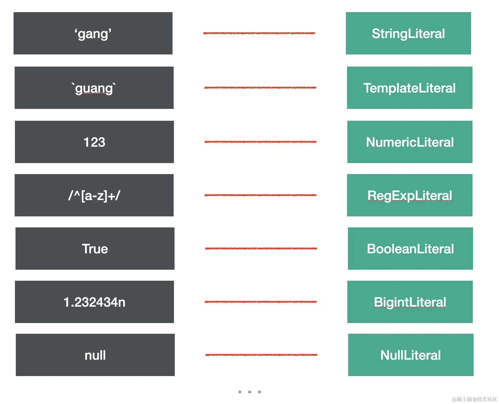
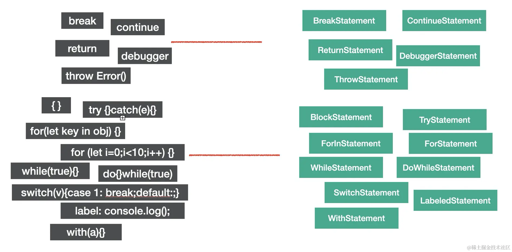
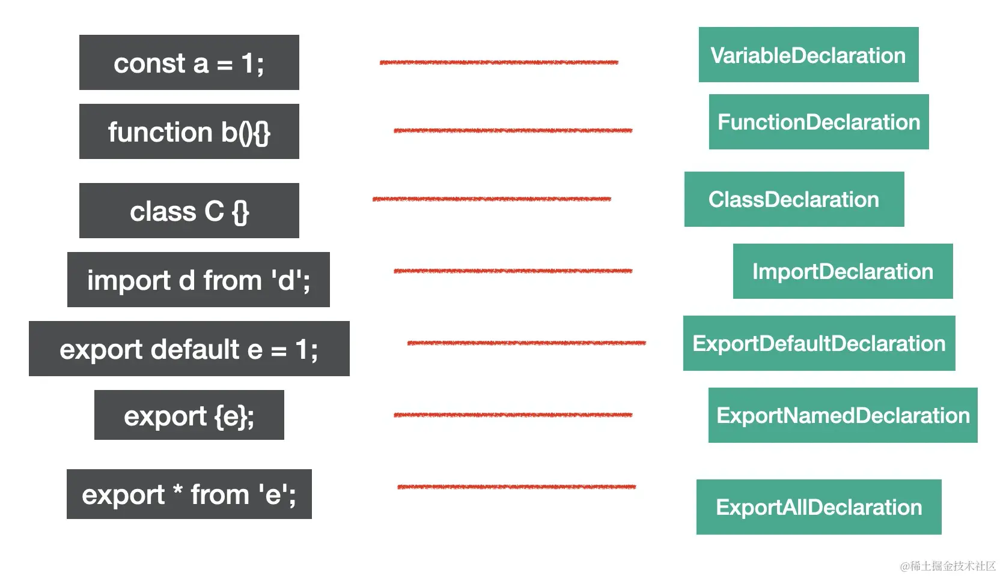
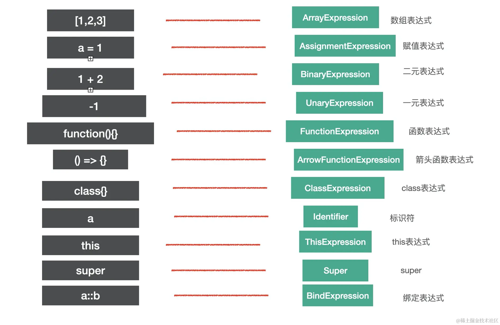
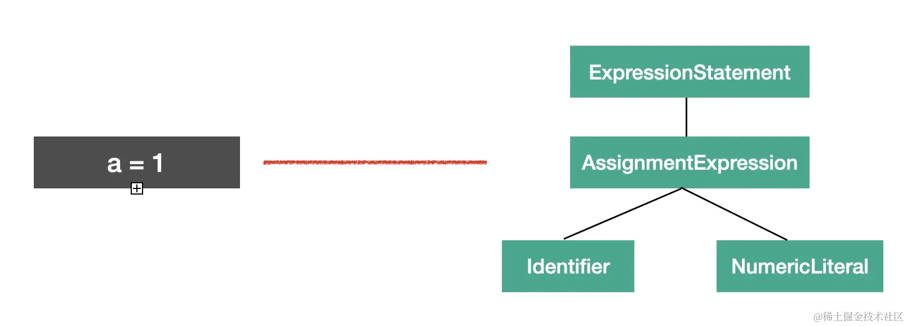
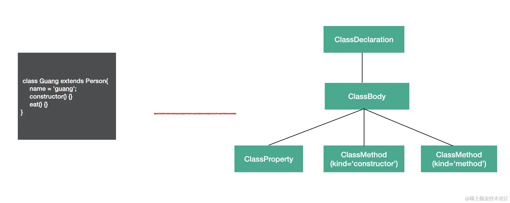
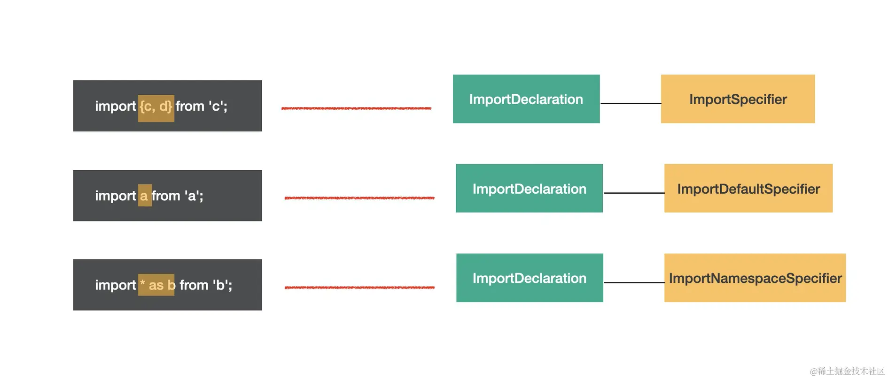
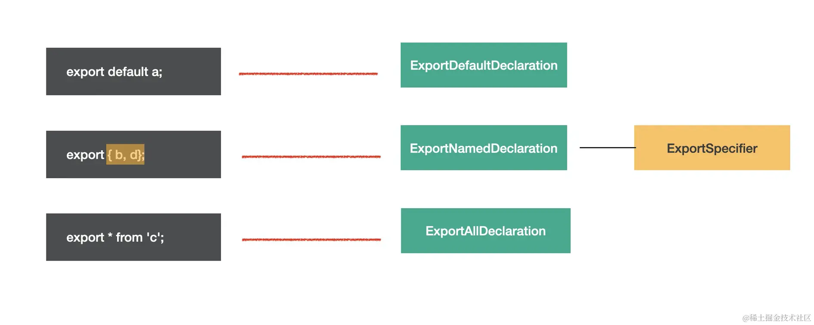
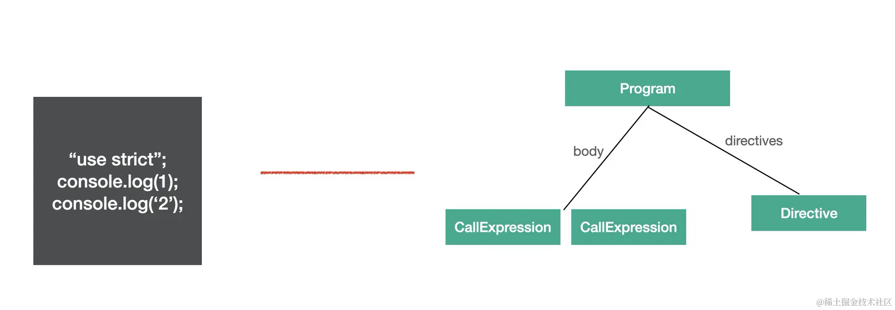

# AST

## 常见的 AST 节点

### Literal

`Literal` 是字面量的意思，比如字符串字面量 `StringLiteral`, 数字字面量 `NumericLiteral` 等。



### Identifier

`Identifier` 是标识符的意思，比如变量名、属性名、参数名、函数名、类名等。

JS 中的标识符只能包含字母或数字或下划线（"_"）或美元符号（"$"），且不能以数字开头。这是 Identifier 的词法特点。

### Statement

`statement` 是语句，它是可以独立执行的单位，比如 `break`、`continue`、`debugger`、`return` 或者 `if` 语句、`while` 语句、`for` 语句，还有声明语句，表达式语句等。我们写的每一条可以独立执行的代码都是语句。

语句末尾一般会加一个分号分隔，或者用换行分隔。

下面这些我们经常写的代码，每一行都是一个 Statement：
```js
break;
continue;
return;
debugger;
throw Error();
{}
try {} catch(e) {} finally{}
for (let key in obj) {}
for (let i = 0;i < 10;i ++) {}
while (true) {}
do {} while (true)
switch (v){case 1: break;default:;}
label: console.log();
with (a){}
```
对应的AST节点：


语句是代码执行的最小单位，可以说，代码是由语句(`statement`)构成的

### Declaration

声明语句是一种特殊的语句，它执行的逻辑是在作用域内声明一个变量、函数、`class`、`import`、`export` 等。
比如以下声明语句：
```js
const a = 1;
function b(){}
class C {}

import d from 'e';

export default e = 1;
export {e};
export * from 'e';
```

对应的 AST 节点：


声明语句用于定义变量，这也是代码中一个基础组成部分。

### Expression

`expression` 是表达式，特点是执行完以后有返回值，这是和语句 (`statement`) 的区别。

比如下面常见的表达式：
```js
[1,2,3]
a = 1
1 + 2;
-1;
function(){};
() => {};
class{};
a;
this;
super;
a::b;
```

对应的AST:


这里的 `identifier`、`super` 有返回值，符合表达式的特点，所以也是 `expression`。

判断 AST 节点是不是某种类型要看它是不是符合该种类型的特点，比如语句的特点是能够单独执行，表达式的特点是有返回值。

有的表达式可以单独执行，符合语句的特点，所以也是语句，比如赋值表达式、数组表达式等。

```js
a=1;
[1,2,3]
```

但有的表达式不能单独执行，需要和其他类型的节点组合在一起构成语句。比如匿名函数表达式和匿名 class 表达式单独执行会报错,需要和其他部分一起构成一条语句，比如组成赋值语句：

```js
a = function() {}
b = class{}
```

`a=1` 这条赋值语句对应的AST：


我们可以发现这条赋值语句的AST节点的 `AssignExpression` 包裹了一层 `ExpressionStatement`的节点，代表这个表达式是被当成语句执行的。

### Class

整个 class 的内容是 ClassBody，属性是 ClassProperty，方法是ClassMethod（通过 kind 属性来区分是 constructor 还是 method）。

比如：
```js
class Guang extends Person{
    name = 'guang';
    constructor() {}
    eat() {}
}
```

对应的AST：


class 是 es next 的语法，babel 中有专门的 AST 来表示它的内容。

### Modules

`es module` 是语法级别的模块规范，所以也有专门的 AST 节点。

#### import

import 有三种语法：

named import：
```js
import {c, d} from 'c';
```

default import：
```js
import a from 'a';
```

namespaced import：
```js
import * as b from 'b';
```
这 3 种语法都对应 `ImportDeclaration` 节点，但是 `specifiers` 属性不同，分别对应 `ImportSpicifier`、`ImportDefaultSpecifier`、`ImportNamespaceSpcifier`。

从图可以看出，import 语法的 AST 的结构是 `ImportDeclaration` 包含着各种 `import specifier`。
#### export

export 也有三种语法：

named export：
```js
export {b, d};
```

default export：
```js
export default a;
```

all export：
```js
export * from 'c';
```
分别对应 `ExportNamedDeclaration`、`ExportDefaultDeclaration`、`ExportAllDeclaration` 的 AST。


### Program & Directive

program 是代表整个程序的节点，它有 body 属性代表程序体，存放 statement 数组，就是具体执行的语句的集合。还有 directives 属性，存放 Directive 节点，比如 `"use strict"` 这种指令会使用 Directive 节点表示。


Program 是包裹具体执行语句的节点，而 Directive 则是代码中的指令部分。

### File & Comment

babel 的 AST 最外层节点是 File，它有 program、comments、tokens 等属性，分别存放 Program 程序体、注释、token 等，是最外层节点。

Comment 注释分为块注释和行内注释，对应 CommentBlock 和 CommentLine 节点。

## AST 可视化查看工具

> [astexplorer](https://astexplorer.net/)

## AST 的公共属性

每种 AST 都有自己的属性，但是它们也有一些公共的属性：

- `type`：AST 节点的类型

- `start、end、loc`：start 和 end 代表该节点在源码中的开始和结束下标。而 loc 属性是一个对象，有 line 和 column 属性分别记录开始和结束的行列号。

- `leadingComments`、`innerComments`、`trailingComments`： 表示开始的注释、中间的注释、结尾的注释，每个 AST 节点中都可能存在注释，而且可能在开始、中间、结束这三种位置，想拿到某个 AST 的注释就通过这三个属性。

- `extra`：记录一些额外的信息，用于处理一些特殊情况。比如 StringLiteral 的 value 只是值的修改，而修改 extra.raw 则可以连同单双引号一起修改。