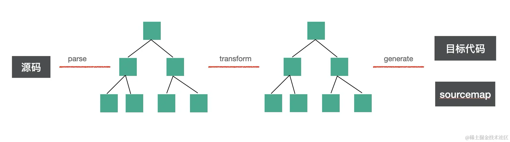
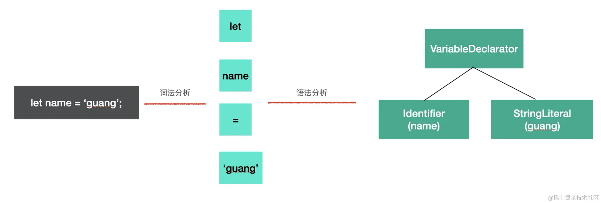
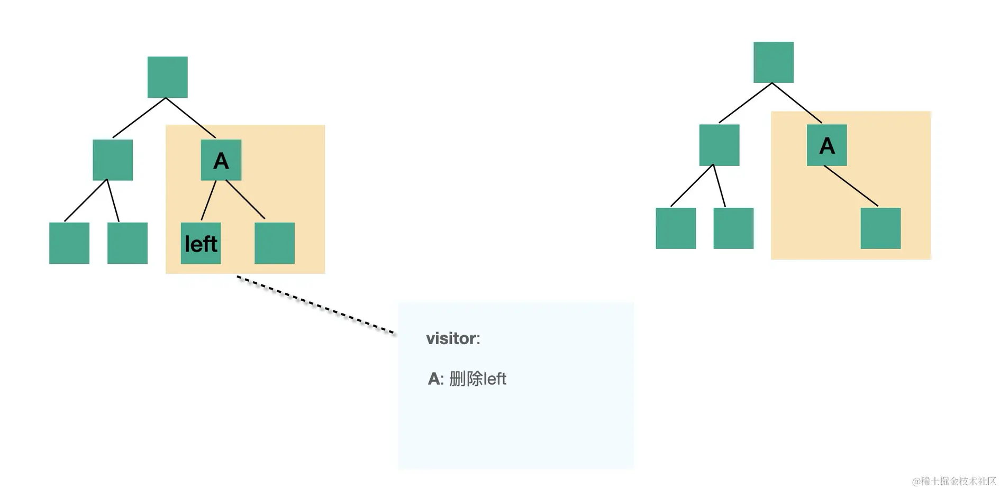
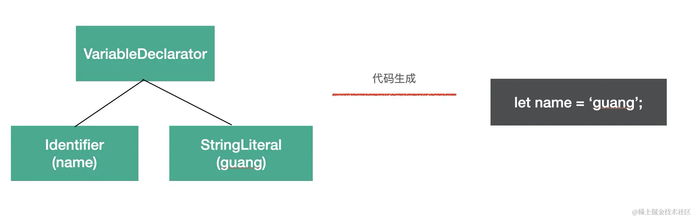

# babel 的编译流程

babel 是 source to source 的转换，整体编译流程分为三步：
- **parse**: 通过 parse 把源码转换成 抽象语法树AST
- **transform**: 遍历 AST, 调用各种transform插件对AST进行增删改
- **generate**: 把转换后的AST打印成目标代码，并生成 sourcemap

## 为什么会分成这三步？（parse、transform、generate）

源码是一串按照语法格式来组织的字符串，人能够认识，但是计算机并不认识

想让计算机认识就要转成一种数据结构，通过不同的对象来保存不同的数据，并且按照依赖关系组织起来，这种数据结构就是抽象语法树（abstract syntax tree）。

之所以叫“抽象”语法树是因为数据结构中省略掉了一些无具体意义的分隔符比如 `;` `{` `}` 等。

有了 AST，计算机就能理解源码字符串的意思，而理解是能够转换的前提，所以编译的第一步需要把源码 parse 成 AST。

转成 AST 之后就可以通过修改 AST 的方式来修改代码，这一步会遍历 AST 并进行各种增删改，这一步也是 babel 最核心的部分。

经过转换以后的 AST 就是符合要求的代码，就可以再转回字符串，转回字符串的过程中把之前删掉的一些分隔符再加回来。

总结：**为了让计算机理解代码需要先对源码字符串进行 parse，生成 AST，把对代码的修改转为对 AST 的增删改，转换完 AST 之后再打印成目标代码字符串。**

## 具体流程

### parse

parse 阶段的目的是把源码字符串转换成机器能够理解的 AST，这个过程分为词法分析、语法分析。

词法分析是指将源码分成一个个不能细分的单词（token）的过程，是按照单词的构成规则来拆分字符串成单词的

之后要把 token 进行递归的组装，生成 AST，这个过程是语法分析，按照不同的语法结构，来把一组单词组合成对象，比如声明语句、赋值表达式等都有对应的 AST 节点。

### transform

transform 阶段是对 parse 生成的 AST 的处理，会进行 AST 的遍历，遍历的过程中处理到不同的 AST 节点会调用注册的相应的 visitor 函数，visitor 函数里可以对 AST 节点进行增删改，(一般插件就是也是这么开发)返回新的 AST（可以指定是否继续遍历新生成的 AST）。这样遍历完一遍 AST 之后就完成了对代码的修改。

### generate

generate 阶段会把 AST 打印成目标代码字符串，并且会生成 sourcemap。不同的 AST 对应的不同结构的字符串。比如 IfStatement 就可以打印成 if(test) {} 格式的代码。这样从 AST 根节点进行递归的字符串拼接，就可以生成目标代码的字符串。

#### sourcemap

sourcemap 记录了源码到目标代码的转换关系，通过它我们可以找到目标代码中每一个节点对应的源码位置，用于调试的时候把编译后的代码映射回源码，或者线上报错的时候把报错位置映射到源码。

> 关于[《Babel插件通关秘籍》](https://juejin.cn/book/6946117847848321055) 的学习笔记