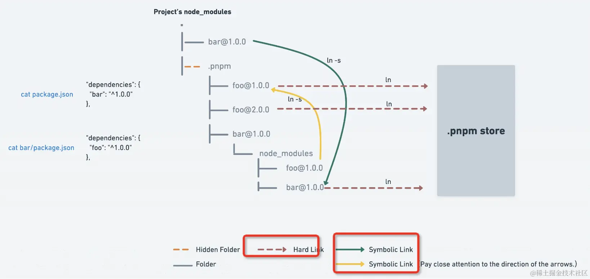

# 📦包管理工具和Monorepo

## npm link

npm link 通常用来把项目安装到全局，并注册全局命令

实现原理是 **软链接**

npm link 工作原理：
- 在 npm get prefix 下的 lib/node_modules 安装了这个包（用 ln -s 创建的软链）
- 在 npm get prefix 下的 bin 里放了这个包里注册的命令（用 ln -s 创建的软链）

而 npm link xxx 则是再把这个包 link 到项目的 node_modules 下，并且把命令 link 到项目的 node_modules/.bin 下。

npm link 和 npm install 一样，就是用软链模拟的 npm install 的过程。

所以删除链接自然也是可以用 npm uninstall

## Monorepo

monorepo 是多个包在同一个项目中管理的方式，是很流行的项目组织形式。

主流的开源包基本都是用 monorepo 的形式管理的。

Monorepo 用来解决：**工程化配置重复、link 麻烦、执行命令麻烦、版本更新麻烦** 等问题。

而Monorepo 存在的三个问题：
- 不同包的自动link
- 命令的按顺序执行
- 版本更新、自动tag、发布

**解决：**

1. 不同包的自动link问题用 `pmpm workspace、npm workspace、yarn workspace` 都可以解决。
2. 命令的按顺序执行问题用 `pnpm exec` 也可以保证按照拓扑顺序执行，或者用 `npm exec` 或者 `yarn exec` 也可以。
3. 版本更新、自动tag、发布问题用 `@changesets/cli` 就可以做到

## 软硬链接区别以及pnpm实现原理

### 包管理工具的历史：
- npm2 通过嵌套的方式来管理 node_modules ，会有同样的依赖复制多次的问题。
- npm3+ 和 yarn 通过铺平的扁平化的方式来管理 node_modules，解决了嵌套方式的部分问题，但是引入了幽灵依赖的问题，并且同名的包只会提升一个版本的，其余的版本依然会复制多次。

pnpm 则是用了另一种方式，不再是复制了，而是都从全局 store 硬连接到 node_modules/.pnpm，然后之间通过软链接来组织依赖关系。

> 优点：节省磁盘空间，也没有幽灵依赖问题，安装速度还快，从机制上来说完胜 npm 和 yarn。

### 软硬链接区别：

软硬链接是操作系统提供的机制。硬连接就是同一个文件的不同引用，而软链接是新建一个文件，文件内容指向另一个路径。

如果不复制文件，只在全局仓库保存一份 npm 包的内容，其余的地方都 link 过去，这样不会有复制多次的磁盘空间浪费，而且也不会有路径过长的问题。因为路径过长的限制本质上是不能有太深的目录层级，现在都是各个位置的目录的 link，并不是同一个目录，所以也不会有长度限制。

### pnpm 原理

