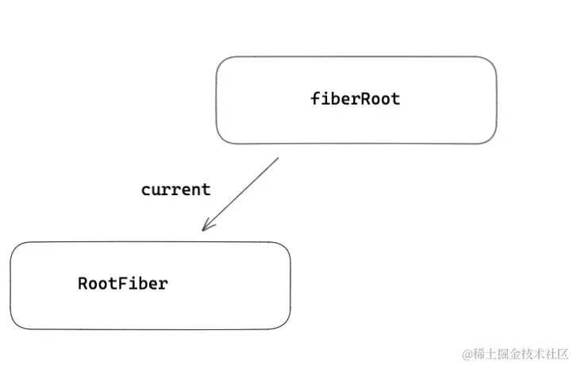
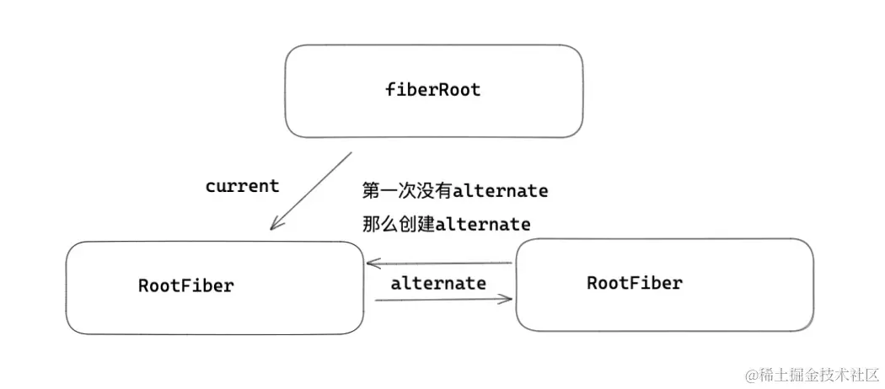
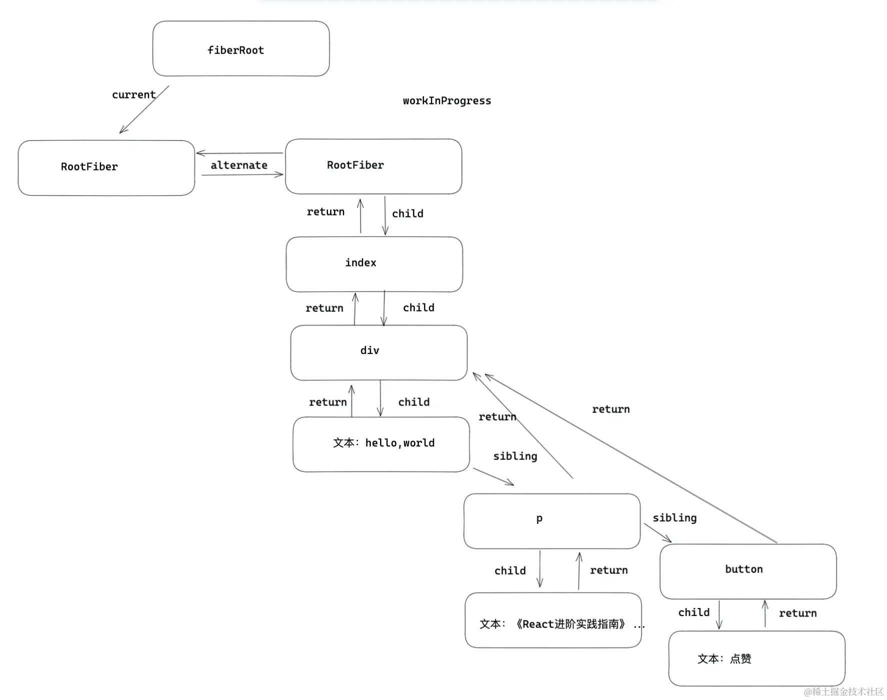
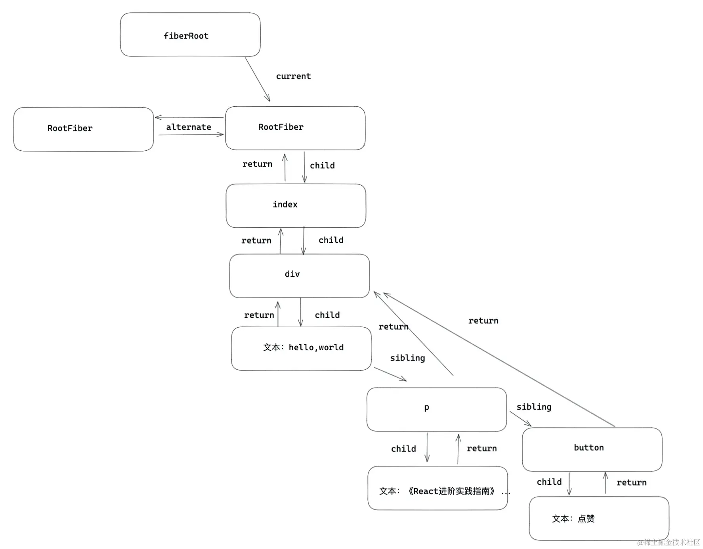
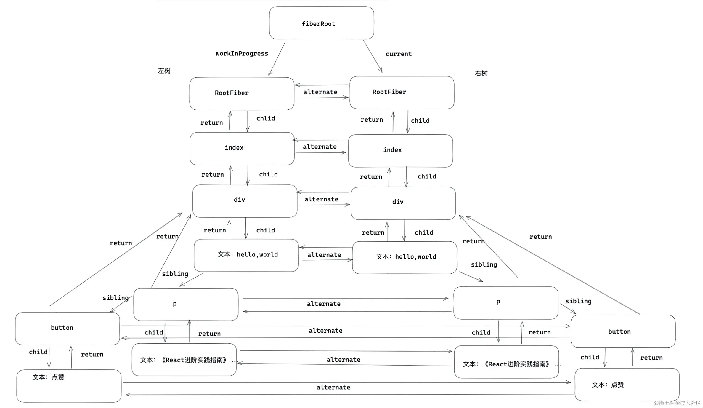
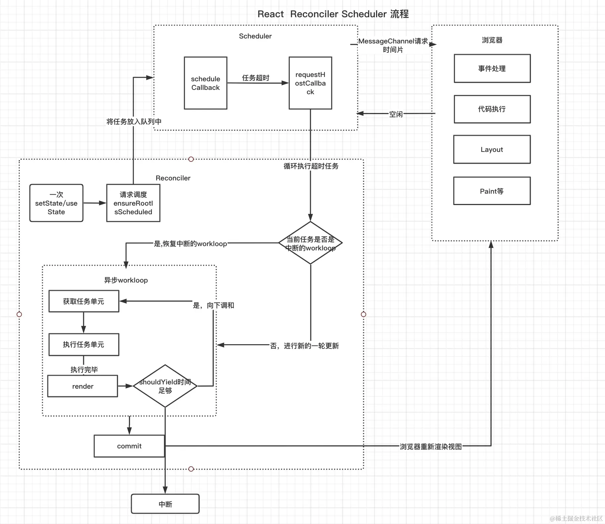

# React Fiber

## 前言

### 问题

JavaScript引擎和页面渲染引擎两个线程是互斥的，当其中一个线程执行时，另一个线程只能挂起等待

如果 JavaScript 线程长时间地占用了主线程，那么渲染层面的更新就不得不长时间地等待，界面长时间不更新，会导致页面响应度变差，用户可能会感觉到卡顿

而这也正是 React 15 的 Stack Reconciler 所面临的问题，当 React 在渲染组件时，从开始到渲染完成整个过程是一气呵成的，无法中断

如果组件较大，那么js线程会一直执行，然后等到整棵VDOM树计算完成后，才会交给渲染的线程

这就会导致一些用户交互、动画等任务无法立即得到处理，导致卡顿的情况

- 什么是fiber ? Fiber 架构解决了什么问题？ 
- Fiber root 和 root fiber 有什么区别？ 
- 不同fiber 之间如何建立起关联的？
- React 调和流程？
- 两大阶段 commit 和 render 都做了哪些事情？
- 什么是双缓冲树？ 有什么作用？
- Fiber 深度遍历流程？
- Fiber的调和能中断吗？ 如何中断？


## 什么是 fiber

Fiber 的英文的是’纤维‘，fiber 诞生在 Reactv16 版本，整个 React 团队花费两年时间重构 fiber 架构，目的就是解决大型 React 应用卡顿；

fiber 在 React 中是最小粒度的执行单元，无论 React 还是 Vue ，在遍历更新每一个节点的时候都不是用的真实 DOM ，都是采用虚拟 DOM ，所以可以理解成 fiber 就是 React 的虚拟 DOM 。

## 为什么要用fiber

在 Reactv15 以及之前的版本，React 对于虚拟 DOM 是采用递归方式遍历更新的，比如一次更新，就会从应用根部递归更新，递归一旦开始，中途无法中断，随着项目越来越复杂，层级越来越深，导致更新的时间越来越长，给前端交互上的体验就是卡顿。

Reactv16 为了解决卡顿问题引入了 fiber ，为什么它能解决卡顿：
更新 fiber 的过程叫做 `Reconciler`（调和器），每一个 fiber 都可以作为一个执行单元来处理，所以每一个 fiber 可以根据自身的过期时间`expirationTime`（ v17 版本叫做优先级 `lane` ）来判断是否还有空间时间执行更新，如果没有时间更新，就要把主动权交给浏览器去渲染，做一些动画，重排（reflow），重绘（repaints）之类的事情，这样就能给用户感觉不是很卡。然后等浏览器空余时间，在通过 `scheduler` （调度器），再次恢复执行单元上来，这样就能本质上中断了渲染，提高了用户体验。

## 全面认识 Fiber

### 1 element,fiber,dom 三者关系

- element 是 React 视图层在代码层级上的表象，也就是开发者写的 jsx 语法，写的元素结构，都会被创建成 element 对象的形式。上面保存了 props ， children 等信息。
- DOM 是元素在浏览器上给用户直观的表象。
- fiber 可以说是是 element 和真实 DOM 之间的交流枢纽站，一方面每一个类型 element 都会有一个与之对应的 fiber 类型，element 变化引起更新流程都是通过 fiber 层面做一次调和改变，然后对于元素，形成新的 DOM 做视图渲染。

### 2 fiber保存了那些信息

> react-reconciler/src/ReactFiber.js

```js
function FiberNode(){

  this.tag = tag;                  // fiber 标签 证明是什么类型fiber。
  this.key = key;                  // key调和子节点时候用到。 
  this.type = null;                // dom元素是对应的元素类型，比如div，组件指向组件对应的类或者函数。  
  this.stateNode = null;           // 指向对应的真实dom元素，类组件指向组件实例，可以被ref获取。
 
  this.return = null;              // 指向父级fiber
  this.child = null;               // 指向子级fiber
  this.sibling = null;             // 指向兄弟fiber 
  this.index = 0;                  // 索引

  this.ref = null;                 // ref指向，ref函数，或者ref对象。

  this.pendingProps = pendingProps;// 在一次更新中，代表element创建
  this.memoizedProps = null;       // 记录上一次更新完毕后的props
  this.updateQueue = null;         // 类组件存放setState更新队列，函数组件存放
  this.memoizedState = null;       // 类组件保存state信息，函数组件保存hooks信息，dom元素为null
  this.dependencies = null;        // context或是时间的依赖项

  this.mode = mode;                //描述fiber树的模式，比如 ConcurrentMode 模式

  this.effectTag = NoEffect;       // effect标签，用于收集effectList
  this.nextEffect = null;          // 指向下一个effect

  this.firstEffect = null;         // 第一个effect
  this.lastEffect = null;          // 最后一个effect

  this.expirationTime = NoWork;    // 通过不同过期时间，判断任务是否过期， 在v17版本用lane表示。

  this.alternate = null;           //双缓存树，指向缓存的fiber。更新阶段，两颗树互相交替。
}

```

### 3 每一个fiber如何建立起关联

每个 fiber 通过 return child sibling 三个属性建立起联系

- return: 指向父级 Fiber 节点
- child: 指向子 Fiber 节点
- sibling: 指向兄弟 Fiber 节点（右边第一个）

## Fiber 更新机制

### 1 初始化

#### 第一步：创建 fiberRoot 和 rootFiber

- fiberRoot：首次构建应用， 创建一个 fiberRoot ，作为整个 React 应用的根基。
- rootFiber： 通过 ReactDOM.render 渲染出来的 rootFiber 。一个 React 应用可以有多 ReactDOM.render 创建的 rootFiber ，但是只能有一个 fiberRoot（应用根节点）

第一次挂载的过程中，会将 fiberRoot 和 rootFiber 建立起关联
```js
function createFiberRoot(containerInfo,tag){
    /* 创建一个root */
    const root = new FiberRootNode(containerInfo,tag)
    const rootFiber = createHostRootFiber(tag);
    root.current = rootFiber
    return root
}
```
fiberRoot.current = rootFiber



#### 第二步：workInProgress 和 current

经过第一步的处理，开始到正式渲染阶段，会进入 beginwork 流程

- workInProgress: 正在内存中构建的 Fiber 树成为 workInProgress Fiber 树。

    在一次更新中，所有的更新都是发生在 workInProgress 树上。在一次更新之后，workInProgress 树上的状态是最新的状态，那么它将变成 current 树用于渲染视图。
- current：正在视图层渲染的树叫做 current 树。

接下来会到 rootFiber 的渲染流程，首先会复用当前 current 树（ rootFiber ）的 alternate 作为 workInProgress ，如果没有 alternate （初始化的 rootFiber 是没有 alternate ），那么会创建一个 fiber 作为 workInProgress 。会用 alternate 将新创建的 workInProgress 与 current 树建立起关联。这个关联过程只有初始化第一次创建 alternate 时候进行。



#### 第三步：深度调和子节点，渲染视图

接下来会按照第二步，在新创建的 alternates 上，完成整个 fiber 树的遍历，包括 fiber 的创建。



最后会以 workInProgress 作为最新的渲染树，fiberRoot 的 current 指针指向 workInProgress 使其变为 current Fiber 树。到此完成初始化流程。



### 2 更新

如果触发更新，首先会走上面的逻辑，重新创建一颗 workInProgresss 树，复用当前 current 树上的 alternate ，作为新的 workInProgress ，由于初始化 rootfiber 有 alternate ，所以对于剩余的子节点，React 还需要创建一份，和 current 树上的 fiber 建立起 alternate 关联。渲染完毕后，workInProgresss 再次变成 current 树。



### 双缓冲树

canvas 绘制动画的时候，如果上一帧计算量比较大，导致清除上一帧画面到绘制当前帧画面之间有较长间隙，就会出现白屏。为了解决这个问题，canvas 在内存中绘制当前动画，绘制完毕后直接用当前帧替换上一帧画面，由于省去了两帧替换间的计算时间，不会出现从白屏到出现画面的闪烁情况。这种在内存中构建并直接替换的技术叫做双缓存。

React 用 workInProgress 树(内存中构建的树) 和 current (渲染树) 来实现更新逻辑。双缓存一个在内存中构建，一个渲染视图，两颗树用 alternate 指针相互指向，在下一次渲染的时候，直接复用缓存树做为下一次渲染树，上一次的渲染树又作为缓存树，这样可以防止只用一颗树更新状态的丢失的情况，又加快了 DOM 节点的替换与更新。

## render 和 commit

render 阶段和 commit 阶段是整个 fiber Reconciler 的核心

### 1 render阶段

整个 fiber 遍历的开始——workLoop

> react-reconciler/src/ReactFiberWorkLoop.js

```js
function workLoop (){
    while (workInProgress !== null ) {
      workInProgress = performUnitOfWork(workInProgress);
    }
}
```

每个 fiber 可以看作一个执行单元，在调和的过程中，每个发生更新的 fiber 都会作为一次 workInProgress。那么 workLoop 就是执行每个单元的调度器，如果渲染没有中断，那么workLoop 会遍历一遍 fiber 树。 

performUnitOfWork 包括两个阶段 beginWork 和 completeWork 。

> react-reconciler/src/ReactFiberWorkLoop.js

```js
function performUnitOfWork(){
    next = beginWork(current, unitOfWork, renderExpirationTime);
    if (next === null) {
       next = completeUnitOfWork(unitOfWork);
    }
}
```

- beginWork：是向下调和的过程。就是由 fiberRoot 按照 child 指针逐层向下调和，期间会执行函数组件，实例类组件，diff 调和子节点，打不同effectTag（副作用标签）。

react 是如何调和子节点的：

> react-reconciler/src/ReactFiberBeginWork.js

```js
function reconcileChildren(current,workInProgress){
   if(current === null){  /* 初始化子代fiber  */
        workInProgress.child = mountChildFibers(workInProgress,null,nextChildren,renderExpirationTime)
   }else{  /* 更新流程，diff children将在这里进行。 */
        workInProgress.child = reconcileChildFibers(workInProgress,current.child,nextChildren,renderExpirationTime)
   }
}

```

常见的 effectTag：
```js
export const Placement = /*             */ 0b0000000000010;  // 插入节点
export const Update = /*                */ 0b0000000000100;  // 更新fiber
export const Deletion = /*              */ 0b0000000001000;  // 删除fiebr
export const Snapshot = /*              */ 0b0000100000000;  // 快照
export const Passive = /*               */ 0b0001000000000;  // useEffect的副作用
export const Callback = /*              */ 0b0000000100000;  // setState的 callback
export const Ref = /*                   */ 0b0000010000000;  // ref

```


- completeUnitOfWork：是向上归并的过程，如果有兄弟节点，会返回 sibling兄弟，没有返回 return 父级，一直返回到 fiebrRoot ，期间可以形成effectList，对于初始化流程会创建 DOM ，对于 DOM 元素进行事件收集，处理style，className等。

completeUnitOfWork 会将 effectTag 的 Fiber 节点会被保存在一条被称为 effectList 的单向链表中。在 commit 阶段，将不再需要遍历每一个 fiber ，只需要执行更新 effectList 就可以了


这么一上一下，构成了整个 fiber 树的调和

### 2 commit阶段

完成 render 阶段后进行 commit 阶段。commit 阶段做的事情：

- 一方面是对一些生命周期和副作用钩子的处理，比如 componentDidMount ，函数组件的 useEffect ，useLayoutEffect
- 另一方面就是在一次更新中，添加节点（ Placement ），更新节点（ Update ），删除节点（ Deletion ），还有就是一些细节的处理，比如 ref 的处理。

commit 细节可以分为：
- Before mutation 阶段（执行 DOM 操作前）；

```js
function commitBeforeMutationEffects() {
  while (nextEffect !== null) {
    const effectTag = nextEffect.effectTag;
    if ((effectTag & Snapshot) !== NoEffect) {
      const current = nextEffect.alternate;
      // 调用getSnapshotBeforeUpdates
      commitBeforeMutationEffectOnFiber(current, nextEffect);
    }
    if ((effectTag & Passive) !== NoEffect) {
       scheduleCallback(NormalPriority, () => {
          flushPassiveEffects();
          return null;
        });
    }
    nextEffect = nextEffect.nextEffect;
  }
}
```
Before mutation 阶段做的事主要有以下内容：
  - 因为 Before mutation 还没修改真实的 DOM ，是获取 DOM 快照的最佳时期，如果是类组件有 getSnapshotBeforeUpdate ，那么会执行这个生命周期。
  - 会异步调用 useEffect ，因为 useEffect 是采用异步调用的模式，其目的就是防止同步执行时阻塞浏览器做视图渲染。


- mutation 阶段（执行 DOM 操作）；

```js
function commitMutationEffects(){
    while (nextEffect !== null) {
        if (effectTag & Ref) { /* 置空Ref */
            const current = nextEffect.alternate;
            if (current !== null) {
                commitDetachRef(current);
            }
        }
        switch (primaryEffectTag) {
            case Placement: {} //  新增元素
            case Update:{}     //  更新元素
            case Deletion:{}   //  删除元素
        }
    } 
}

```
做的事情：
  - 置空 ref 
  - 对新增元素，更新元素，删除元素。进行真实的 DOM 操作


- layout 阶段（执行 DOM 操作后）

```js
function commitLayoutEffects(root){
     while (nextEffect !== null) {
          const effectTag = nextEffect.effectTag;
          commitLayoutEffectOnFiber(root,current,nextEffect,committedExpirationTime)
          if (effectTag & Ref) {
             commitAttachRef(nextEffect);
          }
     }
}

```
Layout 阶段 DOM 已经更新完毕，Layout 做的事情有：
  - commitLayoutEffectOnFiber 对于类组件，会执行生命周期，setState 的callback，对于函数组件会执行 useLayoutEffect 钩子
  - 如果有 ref ，会重新赋值 ref

### 3 调和 + 异步调度



