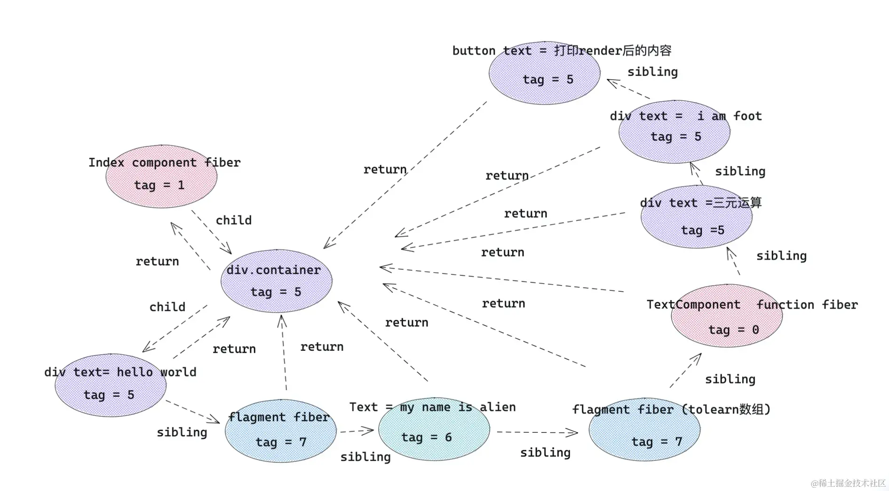

# JSX

## 编译过程

我们写的JSX代码，最终会被 Babel 编译成 `React.createElement()` 方法的调用。

### `React.createElement()`

基本用法
```js
React.createElement(
  type,
  [props],
  [...children]
)
```

`createElement` 参数：
+ 第一个参数：如果是组件类型，会传入组件对应的类或函数；如果是 dom 元素类型，传入 `div` 或者 `span` 之类的字符串。
+ 第二个参数：一个对象，在 dom 类型中为标签属性，在组件类型中为 `props`。
+ 其他参数：依次为 children，根据顺序排列。

老版本的 React 中，为什么写 jsx 的文件要默认引入 React?

例如：
```js
import React from 'react'
function Index(){
    return <div>hello,world</div>
}
```

因为 jsx 在被 babel 编译后，写的 jsx 会变成上述 `React.createElement` 形式，所以需要引入 React，防止找不到 React 引起报错。

### `createElement` 处理后的样子

jsx 的转换规则：
| jsx元素类型         | react.createElement 转换后                   | type 属性                 |
| :----------------: | :------------------------------------------: | :-----------------------: |
| element元素类型     | react element类型                            | 标签字符串，例如 div       | 
| fragment类型        | react element类型                            | symbol react.fragment类型 |
| 文本类型            | 直接字符串                                    | 无                        |
| 数组类型            | 返回数组结构，里面元素被react.createElement转换 | 无                       |
| 组件类型            | react element类型                             | 组件类或者组件函数本身     |
| 三元运算 / 表达式    | 先执行三元运算，然后按照上述规则处理            | 看三元运算返回结果         |
| 函数执行            | 先执行函数，然后按照上述规则处理                | 看函数执行返回结果         |

### React 底层调和处理

在调和阶段，上述 React element 对象的每一个子节点都会形成一个与之对应的 fiber 对象，然后通过 sibling、return、child 将每一个 fiber 对象联系起来。

#### 不同种类的 fiber Tag

React 针对不同 React element 对象会产生不同 tag (种类) 的fiber 对象。

tag 与 element 的对应关系: 
```js
export const FunctionComponent = 0;       // 函数组件
export const ClassComponent = 1;          // 类组件
export const IndeterminateComponent = 2;  // 初始化的时候不知道是函数组件还是类组件 
export const HostRoot = 3;                // Root Fiber 可以理解为根元素 ， 通过reactDom.render()产生的根元素
export const HostPortal = 4;              // 对应  ReactDOM.createPortal 产生的 Portal 
export const HostComponent = 5;           // dom 元素 比如 <div>
export const HostText = 6;                // 文本节点
export const Fragment = 7;                // 对应 <React.Fragment> 
export const Mode = 8;                    // 对应 <React.StrictMode>   
export const ContextConsumer = 9;         // 对应 <Context.Consumer>
export const ContextProvider = 10;        // 对应 <Context.Provider>
export const ForwardRef = 11;             // 对应 React.ForwardRef
export const Profiler = 12;               // 对应 <Profiler/ >
export const SuspenseComponent = 13;      // 对应 <Suspense>
export const MemoComponent = 14;          // 对应 React.memo 返回的组件
```

#### jsx 最终形成的 fiber 结构图



fiber 对应关系
+ child： 一个由父级 fiber 指向子级 fiber 的指针。
+ return：一个子级 fiber 指向父级 fiber 的指针。
+ sibling: 一个 fiber 指向下一个兄弟 fiber 的指针。

> 对于上述在 jsx 中写的 map 数组结构的子节点，外层会被加上 fragment
> map 返回数组结构，作为 fragment 的子节点

## Babel 解析 JSX 流程

### `@babel/plugin-syntax-jsx` 和 `@babel/plugin-transform-react-jsx`

JSX 语法实现来源于这两个 babel 插件：

`@babel/plugin-syntax-jsx`: 使用这个插件，能够让 Babel 有效的解析 JSX 语法。
`@babel/plugin-transform-react-jsx`: 这个插件内部调用了 `@babel/plugin-syntax-jsx`，可以把 React JSX 转化成 JS 能够识别的 `createElement` 格式。

### Automatic Runtime

新版本 React 已经不需要引入 `createElement` ，这种模式来源于 `Automatic Runtime`

例如：
```js
function Index(){
    return <div>
        <h1>hello,world</h1>
        <span>let us learn React</span>
    </div>
}
```

被编译后的文件：
```js
import { jsx as _jsx } from "react/jsx-runtime";
import { jsxs as _jsxs } from "react/jsx-runtime";
function Index() {
  return  _jsxs("div", {
            children: [
                _jsx("h1", {
                   children: "hello,world"
                }),
                _jsx("span", {
                    children:"let us learn React" ,
                }),
            ],
        });
}
```

`plugin-syntax-jsx` 已经向文件中提前注入了 `_jsxRuntime api`。不过这种模式下需要我们在 `.babelrc` 设置 `runtime: automatic`

```json
"presets": [    
    ["@babel/preset-react",{
    "runtime": "automatic"
    }]     
],
```

### Classic Runtime

还有一个就是经典模式，在经典模式下，使用 JSX 的文件需要引入 React ，不然就会报错。

```js
import React from 'react'
function Index(){
    return <div>
        <h1>hello,world</h1>
        <span>let us learn React</span>
    </div>
}
```

被编译后的文件
```js
import React from 'react'
function Index(){
    return  React.createElement(
        "div",
        null,
        React.createElement("h1", null,"hello,world"),
        React.createElement("span", null, "let us learn React")
    );
}
```

## 模拟实现

💡[模拟代码](https://github.com/kurobakaito7/babel-plugin/tree/main/simulate-analysis-jsx)