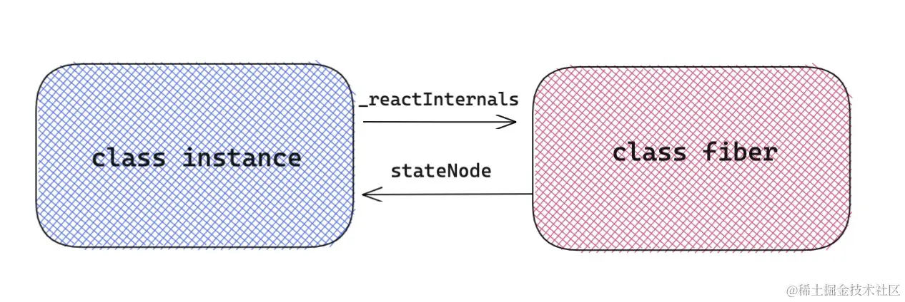
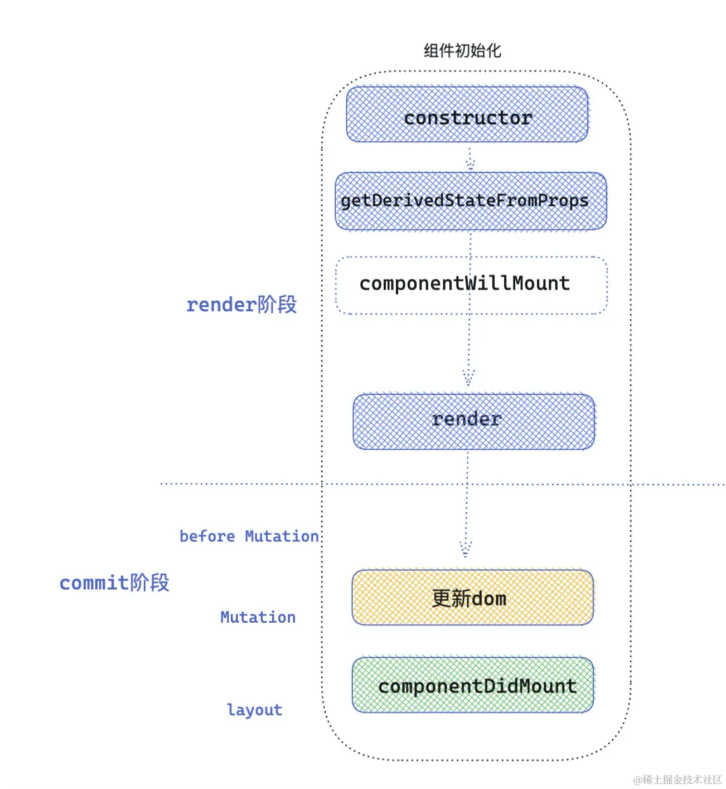
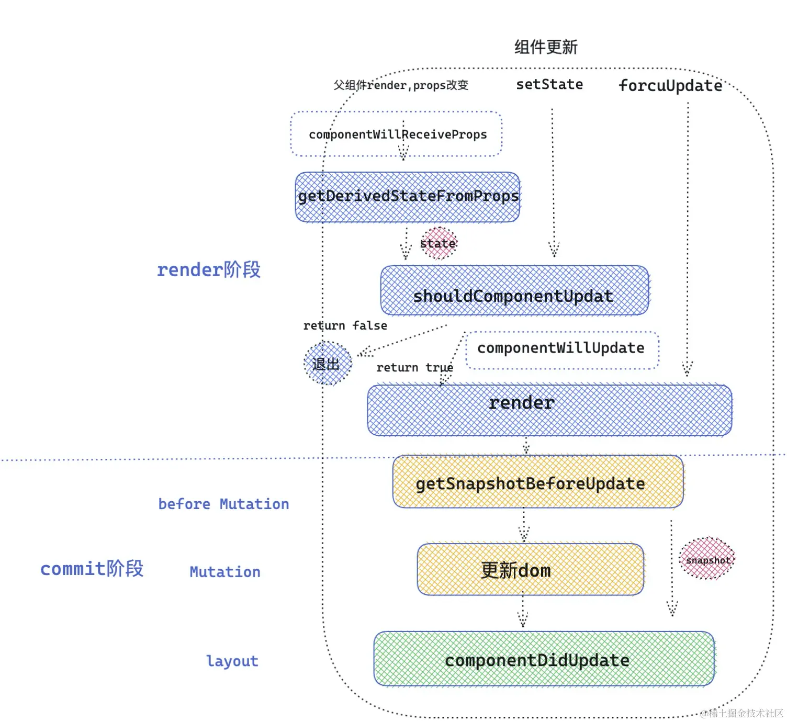
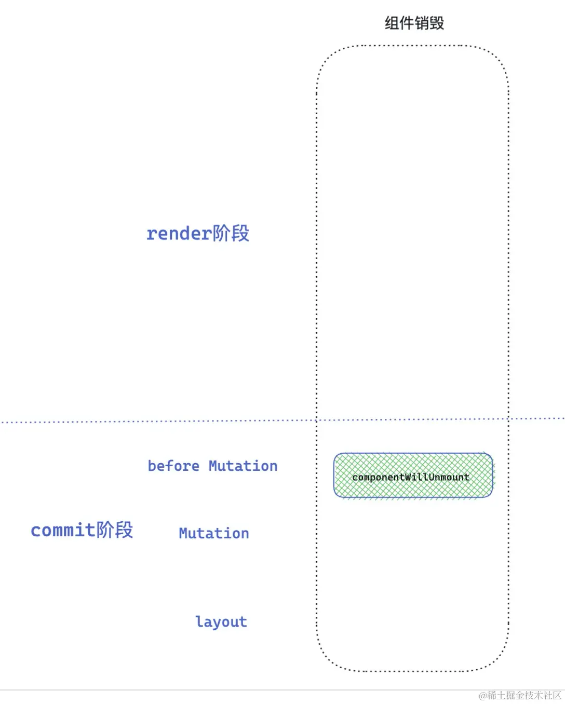
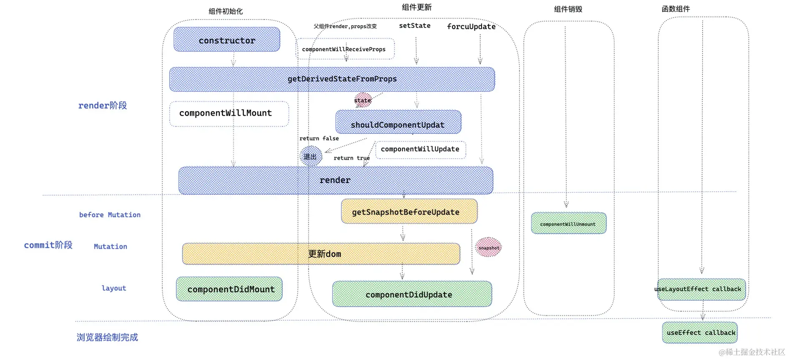

# React 生命周期

React 类组件为开发者提供了一些生命周期钩子函数，能让开发者在 React 执行的重要阶段，在钩子函数里做一些该做的事。自从 React Hooks 问世以来，函数组件也能优雅地使用 Hooks ，弥补函数组件没有生命周期的缺陷。

## 类组件生命周期

### React 两个重要阶段 `render` 和 `commit`

React 在调和( render )阶段会深度遍历 React fiber 树，目的就是发现不同( diff )，不同的地方就是接下来需要更新的地方，对于变化的组件，就会执行 render 函数。在一次调和过程完毕之后，就到了commit 阶段，commit 阶段会创建修改真实的 DOM 节点。

如果在一次调和的过程中，发现了一个 fiber tag = 1 类组件的情况，就会按照类组件的逻辑来处理。

对于类组件的处理逻辑，首先判断类组件是否已经被创建过，首先来看看源码里怎么写的。
> react-reconciler/src/ReactFiberBeginWork.js

```js
/* workloop React 处理类组件的主要功能方法 */
function updateClassComponent(){
    let shouldUpdate
    const instance = workInProgress.stateNode // stateNode 是 fiber 指向 类组件实例的指针。
     if (instance === null) { // instance 为组件实例,如果组件实例不存在，证明该类组件没有被挂载过，那么会走初始化流程
        constructClassInstance(workInProgress, Component, nextProps); // 组件实例将在这个方法中被new。
        mountClassInstance(  workInProgress,Component, nextProps,renderExpirationTime ); //初始化挂载组件流程
        shouldUpdate = true; // shouldUpdate 标识用来证明 组件是否需要更新。
     }else{  
        shouldUpdate = updateClassInstance(current, workInProgress, Component, nextProps, renderExpirationTime) // 更新组件流程
     }
     if(shouldUpdate){
         nextChildren = instance.render(); /* 执行render函数 ，得到子节点 */
        reconcileChildren(current,workInProgress,nextChildren,renderExpirationTime) /* 继续调和子节点 */
     }
}
```
概念：
- `instance` 类组件对应实例。
- `workInProgress` 树，当前正在调和的 fiber 树 ，一次更新中，React 会自上而下深度遍历子代 fiber ，如果遍历到一个 fiber ，会把当前 fiber 指向 workInProgress。
- `current` 树，在初始化更新中，current = null ，在第一次 fiber 调和之后，会将 workInProgress 树赋值给 current 树。React 来用workInProgress 和 current 来确保一次更新中，快速构建，并且状态不丢失。
- `Component` 就是项目中的 class 组件。
- `nextProps` 作为组件在一次更新中新的 props 。
- `renderExpirationTime` 作为下一次渲染的过期时间。

在组件实例上可以通过` _reactInternals` 属性来访问组件对应的 fiber 对象。在 fiber 对象上，可以通过 `stateNode` 来访问当前 fiber 对应的组件实例。两者的关系如下图所示: 


### React 类组件生命周期执行过程探秘

React 的大部分生命周期的执行，都在 `mountClassInstance` `和updateClassInstance` 这两个方法中执行

可以将流程简化成 mount (初始化渲染) 和 update (更新)两个方向

#### 初始化阶段

1. **constructor 执行**

在 mount 阶段，首先执行的 `constructClassInstance` 函数，用来实例化 React 组件

在实例化组件之后，会调用 `mountClassInstance` 组件初始化。
> react-reconciler/src/ReactFiberClassComponent.js

```js
function mountClassInstance(workInProgress,ctor,newProps,renderExpirationTime){
    const instance = workInProgress.stateNode;
     const getDerivedStateFromProps = ctor.getDerivedStateFromProps;
  if (typeof getDerivedStateFromProps === 'function') { /* ctor 就是我们写的类组件，获取类组件的静态方法 */
     const partialState = getDerivedStateFromProps(nextProps, prevState); /* 这个时候执行 getDerivedStateFromProps 生命周期 ，得到将合并的state */
     const memoizedState = partialState === null || partialState === undefined ? prevState : Object.assign({}, prevState, partialState); // 合并state
     workInProgress.memoizedState = memoizedState;
     instance.state = workInProgress.memoizedState; /* 将state 赋值给我们实例上，instance.state  就是我们在组件中 this.state获取的state*/
  }
  if(typeof ctor.getDerivedStateFromProps !== 'function' &&   typeof instance.getSnapshotBeforeUpdate !== 'function' && typeof instance.componentWillMount === 'function' ){
      instance.componentWillMount(); /* 当 getDerivedStateFromProps 和 getSnapshotBeforeUpdate 不存在的时候 ，执行 componentWillMount*/
  }
}
```

2. **getDerivedStateFromProps 执行**

在初始化阶段，`getDerivedStateFromProps` 是第二个执行的生命周期，值得注意的是它是从 ctor 类上直接绑定的静态方法，传入 props ，state 。 返回值将和之前的 state 合并，作为新的 state ，传递给组件实例使用。

3. **componentWillMount 执行**

如果存在 `getDerivedStateFromProps` 和 `getSnapshotBeforeUpdate` 就不会执行生命周期`componentWillMount`。

4. **render 执行**

到此为止 `mountClassInstancec` 函数完成，但是上面 `updateClassComponent` 函数， 在执行完 `mountClassInstancec` 后，执行了 render 渲染函数，形成了 children ， 接下来 React 调用 `reconcileChildren` 方法深度调和 children 。

5. **componentDidMount 执行**

上述提及的几个生命周期都是在 render 阶段执行的。一旦 React 调和完所有的 fiber 节点，就会到 commit 阶段，在组件初始化 commit 阶段，会调用 `componentDidMount` 生命周期。

> react-reconciler/src/ReactFiberCommitWork.js

```js
function commitLifeCycles(finishedRoot,current,finishedWork){
     switch (finishedWork.tag){                             /* fiber tag 在第一节讲了不同fiber类型 */
        case ClassComponent: {                              /* 如果是 类组件 类型 */
             const instance = finishedWork.stateNode        /* 类实例 */
             if(current === null){                          /* 类组件第一次调和渲染 */
                instance.componentDidMount() 
             }else{                                         /* 类组件更新 */
                instance.componentDidUpdate(prevProps,prevState，instance.__reactInternalSnapshotBeforeUpdate); 
             }
        }
     }
}
```
从上面可以直观看到 `componentDidMount` 执行时机 和 `componentDidUpdate` 执行时机是相同的 ，只不过一个是针对初始化，一个是针对组件再更新。到此初始化阶段，生命周期执行完毕。

执行顺序：`constructor -> getDerivedStateFromProps / componentWillMount -> render -> componentDidMount`



#### 更新阶段

接下来为一次类组件的更新阶段，到底会执行那些生命周期函数呢，回到了最开始 `updateClassComponent` 函数了，当发现 current 不为 null 的情况时，说明该类组件被挂载过，那么直接按照更新逻辑来处理。

> react-reconciler/src/ReactFiberClassComponent.js

```js
function updateClassInstance(current,workInProgress,ctor,newProps,renderExpirationTime){
    const instance = workInProgress.stateNode; // 类组件实例
    const hasNewLifecycles =  typeof ctor.getDerivedStateFromProps === 'function'  // 判断是否具有 getDerivedStateFromProps 生命周期
    if(!hasNewLifecycles && typeof instance.componentWillReceiveProps === 'function' ){
         if (oldProps !== newProps || oldContext !== nextContext) {     // 浅比较 props 不相等
            instance.componentWillReceiveProps(newProps, nextContext);  // 执行生命周期 componentWillReceiveProps 
         }
    }
    let newState = (instance.state = oldState);
    if (typeof getDerivedStateFromProps === 'function') {
        ctor.getDerivedStateFromProps(nextProps,prevState)  /* 执行生命周期getDerivedStateFromProps  ，逻辑和mounted类似 ，合并state  */
        newState = workInProgress.memoizedState;
    }   
    let shouldUpdate = true
    if(typeof instance.shouldComponentUpdate === 'function' ){ /* 执行生命周期 shouldComponentUpdate 返回值决定是否执行render ，调和子节点 */
        shouldUpdate = instance.shouldComponentUpdate(newProps,newState,nextContext,);
    }
    if(shouldUpdate){
        if (typeof instance.componentWillUpdate === 'function') {
            instance.componentWillUpdate(); /* 执行生命周期 componentWillUpdate  */
        }
    }
    return shouldUpdate
}
```

1. **执行生命周期 componentWillReceiveProps**

首先判断 `getDerivedStateFromProps` 生命周期是否存在，如果不存在就执行 `componentWillReceiveProps` 生命周期。传入该生命周期两个参数，分别是 `newProps` 和 `nextContext` 。

2. **执行生命周期 getDerivedStateFromProps**

接下来执行生命周期 `getDerivedStateFromProps`， 返回的值用于合并state，生成新的state。

3. **执行生命周期 shouldComponentUpdate**

接下来执行生命周期 `shouldComponentUpdate`，传入新的 props ，新的 state ，和新的 context ，返回值决定是否继续执行 render 函数，调和子节点。这里应该注意一个问题，`getDerivedStateFromProps` 的返回值可以作为新的 state ，传递给 `shouldComponentUpdate` 。

4. **执行生命周期 componentWillUpdate**

接下来执行生命周期 `componentWillUpdate`。`updateClassInstance` 方法到此执行完毕了。

5. **执行 render 函数**

接下来会执行 render 函数，得到最新的 React element 元素。然后继续调和子节点。

6. **执行 getSnapshotBeforeUpdate**

> react-reconciler/src/ReactFiberCommitWork.js

```js
function commitBeforeMutationLifeCycles(current,finishedWork){
     switch (finishedWork.tag) {
          case ClassComponent:{
               const snapshot = instance.getSnapshotBeforeUpdate(prevProps,prevState) /* 执行生命周期 getSnapshotBeforeUpdate   */
                instance.__reactInternalSnapshotBeforeUpdate = snapshot; /* 返回值将作为 __reactInternalSnapshotBeforeUpdate 传递给 componentDidUpdate 生命周期  */
          }
     }
}
```

`getSnapshotBeforeUpdate` 的执行也是在 commit 阶段，commit 阶段细分为 before Mutation( DOM 修改前)，Mutation ( DOM 修改)，Layout( DOM 修改后) 三个阶段，`getSnapshotBeforeUpdate` 发生在before Mutation 阶段，生命周期的返回值，将作为第三个参数 `__reactInternalSnapshotBeforeUpdate` 传递给 `componentDidUpdate` 。

7. **执行 componentDidUpdate**

接下来执行生命周期 `componentDidUpdate` ，此时 DOM 已经修改完成。可以操作修改之后的 DOM 。到此为止更新阶段的生命周期执行完毕。



更新阶段对应的生命周期的执行顺序：

`componentWillReceiveProps( props 改变) / getDerivedStateFromProp -> shouldComponentUpdate -> componentWillUpdate -> render -> getSnapshotBeforeUpdate -> componentDidUpdate`

#### 销毁阶段

> react-reconciler/src/ReactFiberCommitWork.js

```js
function callComponentWillUnmountWithTimer(){
    instance.componentWillUnmount();
}
```

1. **执行生命周期 componentWillUnmount**

销毁阶段就比较简单了，在一次调和更新中，如果发现元素被移除，就会打对应的 Deletion 标签 ，然后在 commit 阶段就会调用 `componentWillUnmount` 生命周期，接下来统一卸载组件以及 DOM 元素。



三个阶段生命周期+无状态组件总览图：



### 函数组件生命周期替代方案

React hooks也提供了 api ，用于弥补函数组件没有生命周期的缺陷。其原理主要是运用了 hooks 里面的 `useEffect` 和 `useLayoutEffect`

#### useEffect 和 useLayoutEffect'

**useEffect**

```js
useEffect(()=>{
    return destory
},dep)

```

useEffect 第一个参数 callback, 返回的 destory ， destory 作为下一次callback执行之前调用，用于清除上一次 callback 产生的副作用。

第二个参数作为依赖项，是一个数组，可以有多个依赖项，依赖项改变，执行上一次callback 返回的 destory ，和执行新的 effect 第一个参数 callback 。

对于 useEffect 执行， React 处理逻辑是采用异步调用 ，对于每一个 effect 的 callback， React 会向 `setTimeout`回调函数一样，放入任务队列，等到主线程任务完成，DOM 更新，js 执行完成，视图绘制完毕，才执行。所以 effect 回调函数不会阻塞浏览器绘制视图。

**useLayoutEffect**

`useLayoutEffect` 和 `useEffect` 不同的地方是采用了同步执行

- 首先 `useLayoutEffect` 是在 DOM 更新之后，浏览器绘制之前，这样可以方便修改 DOM，获取 DOM 信息，这样浏览器只会绘制一次，如果修改 DOM 布局放在 `useEffect` ，那 `useEffect` 执行是在浏览器绘制视图之后，接下来又改 DOM ，就可能会导致浏览器再次回流和重绘。而且由于两次绘制，视图上可能会造成闪现突兀的效果。
- `useLayoutEffect callback` 中代码执行会阻塞浏览器绘制。

**一句话概括如何选择 useEffect 和 useLayoutEffect ：修改 DOM ，改变布局就用 useLayoutEffect ，其他情况就用 useEffect 。**