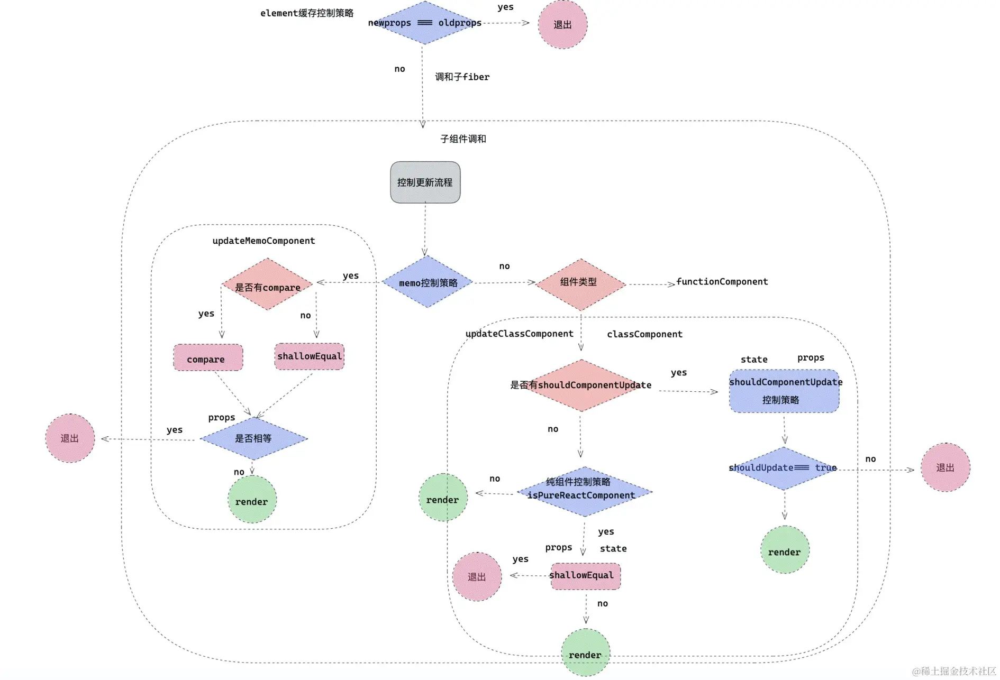

# 渲染控制

## React 渲染
对于 React 渲染，不要仅仅理解成类组件触发 render 函数，函数组件本身执行

事实上，从调度更新任务到调和 fiber，再到浏览器渲染真实 DOM，每一个环节都是渲染的一部分，至于对于每个环节的性能优化，React 在底层已经处理了大部分优化细节，包括设立任务优先级、异步调度、diff算法、时间分片都是 React 为了提高性能，提升用户体验采取的手段。

所以，开发者只需要告诉 React 哪些组件需要更新，哪些组件不需要更新。

于是，React 提供了 PureComponent，shouldComponentUpdated，memo 等优化手段。

### render 阶段的作用

问题：组件在一次更新中，类组件执行 render ，执行函数组件 renderWithHooks （ renderWithHook 内部执行 React 函数组件本身），他们的作用是什么呢？ 他们真实渲染了 DOM 了吗？

真实DOM 是在 commit 阶段挂载的，render 的作用是根据一次更新中产生的新状态值，通过 React.createElement ，替换成新的状态，得到新的 React element 对象，新的 element 对象上，保存了最新状态值。createElement 会产生一个全新的props。到此 render 函数使命完成了。

接下来，React 会调和由 render 函数产生 chidlren，将子代 element 变成 fiber（这个过程如果存在 alternate-候补，会复用 alternate 进行克隆，如果没有 alternate ，那么将创建一个），将 props 变成 pendingProps ，至此当前组件更新完毕。然后如果 children 是组件，会继续重复上一步，直到全部 fiber 调和完毕。完成 render 阶段。

## React 控制 render 的方法

对于 render 的控制，究其本质，主要有两种方式：
- 第一种就是从父组件直接隔断子组件的渲染，经典的就是 `memo` ，缓存 element 对象。
- 第二种就是组件从自身来控制是否 render ，比如：`PureComponent` ，`shouldComponentUpdate` 。

### 1. 缓存 React.element 对象

第一种是对 React.element 对象的缓存。这是一种父对子的渲染控制方案，来源于一种情况，父组件 render ，子组件有没有必要跟着父组件一起 render ，如果没有必要，则就需要阻断更新流

在函数组件中使用 React.useMemo,  需要更新的值放在 deps 中, 值改变，重新形成element对象，否则通过 useMemo 拿到上次的缓存值。

#### useMemo

**用法：**
```js
const cacheSomething = useMemo(create,deps)
```
- `create：`第一个参数为一个函数，函数的返回值作为缓存值
- `deps：`第二个参数为一个数组，存放当前 useMemo 的依赖项，在函数组件下一次执行的时候，会对比 deps 依赖项里面的状态，是否有改变，如果有改变重新执行 create ，得到新的缓存值。
- `cacheSomething：`返回值，执行 create 的返回值。如果 deps 中有依赖项改变，返回的重新执行 create 产生的值，否则取上一次缓存值。

**原理：**
useMemo 会记录上一次执行 create 的返回值，并把它绑定在函数组件对应的 fiber 对象上，只要组件不销毁，缓存值就一直存在，但是 deps 中如果有一项改变，就会重新执行 create ，返回值作为新的值记录到 fiber 对象上。

**应用场景：**

- 可以缓存 element 对象，从而达到按条件渲染组件，优化性能的作用。
- 如果组件中不期望每次 render 都重新计算一些值,可以利用 useMemo 把它缓存起来。
- 可以把函数和属性缓存起来，作为 PureComponent 的绑定方法，或者配合其他Hooks一起使用。

#### 原理

如上利用 element 的缓存，实现了控制子组件不必要的渲染，究其原理是什么呢？

上述每次执行 render 本质上 createElement 会产生一个新的 props，这个 props 将作为对应 fiber 的 `pendingProps` ，在此 fiber 更新调和阶段，React 会对比 fiber 上老 oldProps 和新的 newProp （ pendingProps ）是否相等，如果相等函数组件就会放弃子组件的调和更新，从而子组件不会重新渲染；如果上述把 element 对象缓存起来，上面 props 也就和 fiber 上 oldProps 指向相同的内存空间，也就是相等，从而跳过了本次更新。

### 2. PureComponent

纯组件是一种发自组件本身的渲染优化策略，当开发类组件选择了继承 PureComponent ，就意味这要遵循其渲染规则。**规则就是浅比较 state 和 props 是否相等**。

基本使用：
- 对于 props ，PureComponent 会浅比较 props 是否发生改变，再决定是否渲染组件
- 对于 state ，也会浅比较处理
- 浅比较只会比较基础数据类型，对于引用类型，单纯的改变属性是不会促使组件更新的，因为浅比较两次还是指向同一个内存空间，想要解决这个问题也容易，浅拷贝就可以解决

#### PureComponent 原理及其浅比较原则

`PureComponent` 内部是如何工作的呢？

首先当选择基于 `PureComponent` 继承的组件，原型链上会有 `isPureReactComponent` 属性

创建 `PureComponent` 的时候：
> react/src/ReactBaseClasses.js

```js
/* pureComponentPrototype 纯组件构造函数的 prototype 对象，绑定isPureReactComponent 属性。 */
pureComponentPrototype.isPureReactComponent = true;
```

`isPureReactComponent` 这个属性在更新组件 `updateClassInstance` 方法中使用，在生命周期中，，这个函数在更新组件的时候被调用，在这个函数内部，有一个专门负责检查是否更新的函数 `checkShouldComponentUpdate`。
> react/react-reconciler/ReactFiberClassComponent.js

```js
function checkShouldComponentUpdate(){
     if (typeof instance.shouldComponentUpdate === 'function') {
         return instance.shouldComponentUpdate(newProps,newState,nextContext)  /* shouldComponentUpdate 逻辑 */
     } 
    if (ctor.prototype && ctor.prototype.isPureReactComponent) {
        return  !shallowEqual(oldProps, newProps) || !shallowEqual(oldState, newState)
    }
}
```

- `isPureReactComponent` 用来判断当前组件是不是纯组件，如果是 `PureComponent` 会浅比较 `props` 和 `state` 是否相等
- 注意: `shouldComponentUpdate` 的权重会大于 `PureComponent`

`shallowEqual` 浅比较流程:
- 第一步，首先会直接比较新老 props 或者新老 state 是否相等。如果相等那么不更新组件
- 第二步，判断新老 state 或者 props ，有不是对象或者为 null 的，那么直接返回 false ，更新组件
- 第三步，通过 Object.keys 将新老 props 或者新老 state 的属性名 key 变成数组，判断数组的长度是否相等，如果不相等，证明有属性增加或者减少，那么更新组件
- 第四步，遍历老 props 或者老 state ，判断对应的新 props 或新 state ，有没有与之对应并且相等的（这个相等是浅比较），如果有一个不对应或者不相等，那么直接返回 false ，更新组件。 到此为止，浅比较流程结束， PureComponent 就是这么做渲染节流优化的

#### PureComponent 注意事项

PureComponent 可以让组件自发的做一层性能上的调优，但是，父组件给是 PureComponent 的子组件绑定事件要格外小心，避免两种情况发生：
1. 避免使用箭头函数。不要给是 PureComponent 子组件绑定箭头函数，因为父组件每一次 render ，如果是箭头函数绑定的话，都会重新生成一个新的箭头函数， PureComponent 对比新老 props 时候，因为是新的函数，所以会判断不想等，而让组件直接渲染，PureComponent 作用终会失效。
2. PureComponent 的父组件是函数组件的情况，**绑定函数要用 useCallback 或者 useMemo 处理**。这种情况就是在用 class + function 组件开发项目的时候，如果父组件是函数，子组件是 PureComponent ，那么绑定函数要小心，因为函数组件每一次执行，如果不处理，还会声明一个新的函数，所以 PureComponent 对比同样会失效——可以用 `useCallback` 或者 `useMemo` 解决这个问题，useCallback 首选，这个 hooks `初衷就是为了解决这种情况的。useCallback` 接受二个参数，第一个参数就是需要缓存的函数，第二个参数为deps, deps 中依赖项改变返回新的函数。如上处理之后，就能从根本上解决 PureComponent 失效问题。

#### useCallback 和 useMemo 的区别

`useCallback` 第一个参数就是缓存的内容，`useMemo` 需要执行第一个函数，返回值为缓存的内容

比起 `useCallback` ， `useMemo` 更像是缓存了一段逻辑，或者说执行这段逻辑获取的结果。那么对于缓存 element 用 useCallback 可以吗，答案是当然可以了。

### 3. shouldComponentUpdate

有的时候，把控制渲染，性能调优交给 React 组件本身处理显然是靠不住的，React 需要提供给使用者一种更灵活配置的自定义渲染方案，使用者可以自己决定是否更新当前组件，`shouldComponentUpdate` 就能达到这种效果。

`shouldComponentUpdate` 可以根据传入的新的 `props` 和 `state` ，或者 `newContext` 来确定是否更新组件

但是有一种情况就是如果子组件的 props 是引用数据类型，比如 object ，还是不能直观比较是否相等。那么如果想有对比新老属性相等，怎么对比呢，而且很多情况下，组件中数据可能来源于服务端交互，对于属性结构是未知的。

`immutable.js` 可以解决此问题，`immutable.js` 不可变的状态，对 `Immutable` 对象的任何修改或添加删除操作都会返回一个新的 `Immutable` 对象。鉴于这个功能，所以可以把需要对比的 `props` 或者 `state` 数据变成 `Immutable` 对象，通过对比 `Immutable` 是否相等，来证明状态是否改变，从而确定是否更新组件。

对于 `shouldComponentUpdate` ，它的执行是在 `checkShouldComponentUpdate`函数，会执行此生命周期。

### 4. React.memo
```js
React.memo(Component,compare)
```

`React.memo` 可作为一种容器化的控制渲染方案，可以对比 `props` 变化，来决定是否渲染组件

`React.memo` 接受两个参数，第一个参数 `Component` 原始组件本身，第二个参数 `compare` 是一个函数，可以根据一次更新中 `props` 是否相同决定原始组件是否重新渲染。

memo 的几个特点：
- React.memo: 第二个参数 返回 `true` 组件不渲染 ，返回 `false` 组件重新渲染。和 shouldComponentUpdate 相反，shouldComponentUpdate : 返回 `true` 组件渲染 ，返回 `false` 组件不渲染。
- memo 当二个参数 compare 不存在时，会用**浅比较原则**处理 props ，相当于仅比较 props 版本的 pureComponent 。
- memo 同样适合类组件和函数组件。

**原理**

被 memo 包裹的组件，element 会被打成 `REACT_MEMO_TYPE` 类型的 element 标签，在 element 变成 fiber 的时候， fiber 会被标记成 `MemoComponent` 的类型。
> react/src/ReactMemo.js

```js
function memo(type,compare){
  const elementType = {
    $$typeof: REACT_MEMO_TYPE, 
    type,  // 我们的组件
    compare: compare === undefined ? null : compare,  //第二个参数，一个函数用于判断prop，控制更新方向。
  };
  return elementType
}
```

> react-reconciler/src/ReactFiber.js

```js
case REACT_MEMO_TYPE:
  fiberTag = MemoComponent;
```

对于 `MemoComponent` React 内部的处理：

React 对 MemoComponent 类型的 fiber 有单独的更新处理逻辑 `updateMemoComponent`
> react-reconciler/src/ReactFiberBeginWork.js

```js
function updateMemoComponent(){
    if (updateExpirationTime < renderExpirationTime) {
         let compare = Component.compare;
         compare = compare !== null ? compare : shallowEqual //如果 memo 有第二个参数，则用二个参数判定，没有则浅比较props是否相等。
        if (compare(prevProps, nextProps) && current.ref === workInProgress.ref) {
            return bailoutOnAlreadyFinishedWork(current,workInProgress,renderExpirationTime); //已经完成工作停止向下调和节点。
        }
    }
    // 返回将要更新组件,memo包装的组件对应的fiber，继续向下调和更新。
}
```
主要逻辑：
- 通过 memo 第二个参数，判断是否执行更新，如果没有那么第二个参数，那么以浅比较 props 为 diff 规则。如果相等，当前 fiber 完成工作，停止向下调和节点，所以被包裹的组件即将不更新。
- memo 可以理解为包了一层的高阶组件，它的阻断更新机制，是通过控制下一级 children ，也就是 memo 包装的组件，是否继续调和渲染，来达到目的的。

注意：一般情况下不要试图组件通过第二个参数直接返回 true 来阻断渲染。这样可能会造成很多麻烦。

### 5. 打破渲染限制

1. **forceUpdate** : 类组件更新如果调用的是 `forceUpdate` 而不是 `setState` ，会跳过 `PureComponent` 的浅比较和 `shouldComponentUpdate` 自定义比较。其原理是组件中调用 `forceUpdate` 时候，全局会开启一个 `hasForceUpdate` 的开关。当组件更新的时候，检查这个开关是否打开，如果打开，就直接跳过 `shouldUpdate` 。
2. **context穿透** : 上述的几种方式，都不能本质上阻断 `context` 改变而带来的渲染穿透，所以开发者在使用 Context 要格外小心，既然选择了消费 context ，就要承担 context 改变，带来的更新作用。

### 6. 渲染控制流程图




## 对于 render 的思考

### 1. 有没有必要在乎组件不必要渲染？

在正常情况下，无须过分在乎 React 没有必要的渲染，因为执行 render 不等于真正的浏览器渲染视图，render 阶段执行是在 js 当中，js 中运行代码远快于浏览器的 Rendering 和 Painting 的，更何况 React 还提供了 diff 算法等手段，去复用真实 DOM 。

### 2. 什么时候需要注意渲染节流?

- 第一种情况数据可视化的模块组件（展示了大量的数据），这种情况比较小心因为一次更新，可能伴随大量的 diff ，数据量越大也就越浪费性能，所以对于数据展示模块组件，有必要采取 memo ， shouldComponentUpdate 等方案控制自身组件渲染。
- 第二种情况含有大量表单的页面，React 一般会采用受控组件的模式去管理表单数据层，表单数据层完全托管于 props 或是 state ，而用户操作表单往往是频繁的，需要频繁改变数据层，所以很有可能让整个页面组件高频率 render 。
- 第三种情况就是越是靠近 app root 根组件越值得注意，根组件渲染会波及到整个组件树重新 render ，子组件 render ，一是浪费性能，二是可能执行 useEffect ，componentWillReceiveProps 等钩子，造成意想不到的情况发生。

### 3. 开发细节

- 开发过程中对于大量数据展示的模块，开发者有必要用 shouldComponentUpdate ，PureComponent来优化性能。
- 对于表单控件，最好办法单独抽离组件，独自管理自己的数据层，这样可以让 state 改变，波及的范围更小。
- 如果需要更精致化渲染，可以配合 immutable.js 。
- 组件颗粒化，配合 memo 等 api ，可以制定私有化的渲染空间。