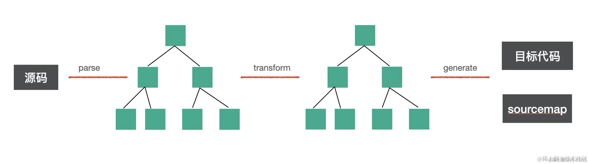
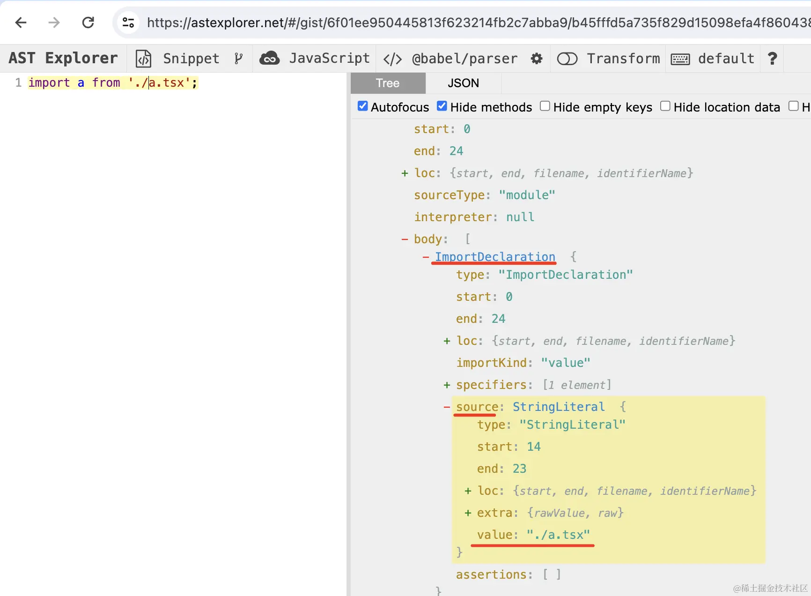

# 💡playground 思路分析和实现原理

## 实现思路

### 编译问题

编译用的 `@babel/standalone`，它是一个浏览器端的 babel 编译器，可以用它实时把 tsx 代码编译成 js

用法：

拿到内容后，用 `babel.transform` 编译，指定 `typescript` 和 `react` 的 `preset`，然后拿到编译后的代码,格式像这样：
```js
import {useState} from 'react';
export default function App() {
    // ..........
    return /*#__PURE__*/React.createElement("div", null, "Hello world!");
}
```
**问题：**

运行代码的时候，会引入 `import` 的模块，这时会找不到。

当然，我们可以像 vite 的 `dev server` 那样做一个根据 `moduleId` 返回编译后的模块内容的服务。

但这里是纯前端项目，显然不适合。

**解决：**

import 的 url 可以用 `blob url`。

可以将一段JS代码，用 `URL.createObjectURL` 和 `new Blob` 的方式变为一个 url
```js
URL.createObjectURL(new Blob([code], { type: 'application/javascript' }))
```

#### 在项目中实际运用

在项目界面左侧写的所有代码都是有文件名的，我们只需要根据文件名替换 import 的 url 即可。

比如 App.tsx 引入了 `./Aaa.tsx`
```tsx
import Aaa from './Aaa.tsx';

export default function App() {
    return <Aaa></Aaa>
}
```
维护拿到 `Aaa.tsx` 的内容，然后通过 `Blob` 和 `URL.createObjectURL` 的方式把 `Aaa.tsx` 内容变为一个 blob url，替换 import 的路径即可。

**如何替换？**

写一个 babel 插件——

思路：

babel 编译流程分为 `parse、transform、generate` 三个阶段。

babel 插件就是在 `transform` 的阶段增删改 AST 的:


可以通过[astexplorer.net](https://astexplorer.net/)查看对应的AST


对 `ImportDeclaration` 的 AST 做处理，把 `source.value` 替换为对应文件的 `blob url`——这样浏览器就能直接跑这段代码

**如何引入 react 和 react-dom 包？**

因为 react 和 react-dom包并不是在左侧写的代码文件——那么如何引入呢？

**解决：**

`import maps` 机制
```html
<body>
    <script type="importmap">
        {
            "imports": {
                "react": "https://esm.sh/react@18.2.0"
            }
        }
    </script>
    <script type="module">
        import React from "react";

        console.log(React);
    </script>
</body>
```
这样 import react 就生效了

**使用的是 [esm.sh](https://esm.sh)专门提供 esm 模块的 CDN 服务**

### 编译器部分

使用 `@monaco-editor/react` 库

### 预览部分

使用 `iframe` ，然后加一个通信机制，左边编辑器的结果，编译之后传到 `iframe` 里渲染

**Preview 组件：**
```tsx
import React from 'react'

import iframeRaw from './iframe.html?raw';

const iframeUrl = URL.createObjectURL(new Blob([iframeRaw], { type: 'text/html' }));

const Preview: React.FC = () => {

  return (
    <iframe
        src={iframeUrl}
        style={{
            width: '100%',
            height: '100%',
            padding: 0,
            border: 'none'
        }}
    />
  )
}

export default Preview;
```

**iframe.html:**
```html
<!doctype html>
<html lang="en">
<head>
  <meta charset="UTF-8"/>
  <meta name="viewport" content="width=device-width, initial-scale=1.0"/>
  <title>Preview</title>
  <style>
    * {
      padding: 0;
      margin: 0;
    }
  </style>
</head>
<body>
<script type="importmap">
  {
    "imports": {
      "react": "https://esm.sh/react@18.2.0",
      "react-dom/client": "https://esm.sh/react-dom@18.2.0"
    }
  }
</script>
<script>

</script>
<script type="module">
  import React, {useState, useEffect} from 'react';
  import ReactDOM from 'react-dom/client';

  const App = () => {
    return React.createElement('div', null, 'aaa');
  };

  window.addEventListener('load', () => {
    const root = document.getElementById('root')
    ReactDOM.createRoot(root).render(React.createElement(App, null))
  })
</script>

<div id="root">
  <div style="position:absolute;top: 0;left:0;width:100%;height:100%;display: flex;justify-content: center;align-items: center;">
    Loading...
  </div>
</div>

</body>
</html>
```

路径后面加个 `?raw` 是通过字符串引入(webpack 和 vite 都有这种功能)

然后用 `URL.createObjectURL + Blob` 生成 `blob url` 设置到 `iframe` 的 `src` 上

这样，只需要内容变了之后生成新的 `blob url` 就好啦！

以上就是从编辑器到编译到预览的流程

[🔖项目源码地址](https://github.com/kurobakaito7/react-playground)
