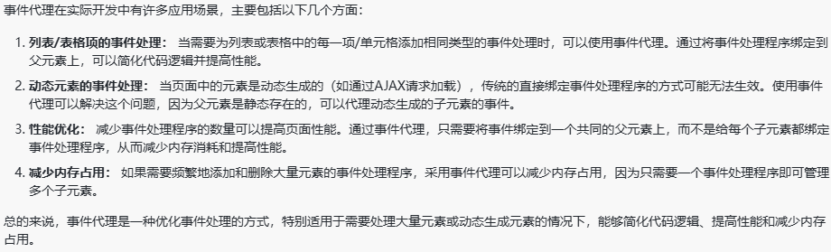

# JS知识集合

设计模式>计网>编译原理>算法>OS>计组
## 数据类型

#### 基本数据类型

Number
+ 数值最常见的整数类型格式则为十进制，还可以设置八进制（0开头），十六进制（0x开头）
+ 在数值类型中，存在一个特殊值NaN，意为“不是数值”，用于表示本来要返回数值的操作失败了（而不是抛出错误）
String
+ 字符串可以使用双引号，单引号或者反引号标识
Boolean
+ 通过Boolean可以将其他类型的数据转化成布尔值
Undefined
+ Undefined类型只有一个值，代表的含义是未定义，就是特殊值undefined，当使用了var 或者 let 声明了变量但是没有初始化时，就相当于给变量赋予了undefined值
Null
+ Null类型同样只有一个值，即特殊值null。逻辑上讲，null值表示一个空指针对象，这也是给typeof传入一个null会返回object的原因
BigInt(ES11引入)
+ 是一种数字类型的数据，它可以表示任何精度格式的整数，使得BigInt可以安全地存储和操作大整数，即使这个数已经超出了Number能够表示的安全整数范围。
Symbol(ES6引入)
+ 代表创建后独一无二并且不可改变的数据类型，它主要是为了解决可能出现的全局变量冲突的问题。

#### 引用数据类型

Object
创建object的常用方式为对象字面量表示法，属性名可以是字符串或数值
Array
js数组是一组有序的数据，但跟其他语言不同的是，数组中每个槽位可以存储任意类型的数据。并且，数组也是动态大小的，会随着数据添加而自动增长。
Function
函数实际上是对象，每个函数都是Function类型的实例，而Function也有属性和方法，跟其他引用类型一样。

其他的引用类型
Date、RegExp、Map、Set

Set和WeakSet是JavaScript中的两种集合类型，它们都用于存储一组唯一的值，但在某些方面有所不同。

+ Set 是一种集合，它可以存储任何类型的值，且值在集合中是唯一的。它的 API 包括添加、删除、查询值是否存在等方法。
+ WeakSet 是一种弱引用集合，它只能存储对象类型的值，并且这些值都是弱引用的。这意味着在没有其他引用指向某个对象时，该对象可能会被垃圾回收。WeakSet 没有迭代器且不可迭代，因此不能遍历其中的内容。
通常情况下，如果需要存储一组唯一的对象引用，并且这些对象在其他地方也被引用，可以使用 Set。而如果需要存储一组对象引用，并且不希望这些对象因为存储在集合中而阻止被垃圾回收，可以考虑使用 WeakSet。

#### 两种类型的区别

**存储位置：**

+ 因为原始数据类型占据空间小，大小固定，属于被频繁使用的数据，所以放进栈中储存具有更高的性能
+ 栈（Stack）的内存分配效率高，自动管理内存（由编译器分配和释放）
+ 引用数据类型占据空间大、大小不固定。如果存储在栈中，将会影响程序运行的性能；引用数据类型在栈中存储了指针，该指针指向堆中该实体的起始地址。当解释器寻找引用值时，会首先检索其在栈中的地址，取得地址后从堆中获得实体。
+ 堆（heap）的内存分配灵活，但需要手动管理内存（通过垃圾回收机制）

**赋值方式**

+ 原始类型：复制的是值的本身，例如将一个number类型的变量赋值给另一个变量，两个变量互不影响。
+ 引用类型：复制的是引用（指针），多个变量引用同一个对象时，一个变量的修改会影响其他变量。


## 数据类型检测方式

1. typeof
typeof判断基本数据类型的原理主要基于计算机底层二进制值的表示。

在计算机底层，所有的数据类型值都按照二进制进行存储。对于不同的数据类型，其二进制表示的前几位往往包含类型信息。typeof操作符正是根据这些二进制位来判断数据类型。

例如，如果前三位是000，通常被认为是对象（Object）；如果是010，则被认为是浮点数（Float）；如果是100，则被认为是字符串（String）；如果是110，则被认为是布尔值（Boolean）；如果是1（且后续位符合整数的表示），则被认为是整数（Integer）。

特殊：

null：虽然null在JavaScript中不是对象，但其二进制表示全为0，因此typeof null会返回"object"。
undefined：对于未声明的变量或未赋值的变量，typeof会返回"undefined"。
function：在JavaScript中，函数也是对象的一种，但typeof能够特别识别出函数类型，并返回"function"。这是因为在JavaScript底层，函数对象有特殊的标记，使得typeof能够区分它们和普通对象。

2. instanceof
instanceof 操作符用于判断一个对象是否是某个构造函数的实例。它通过检查对象的原型链来确定对象是否属于某个类。

3. constructor
   `constructor` 有两个作用，一是判断数据的类型，二是对象实例通过 `constrcutor` 对象访问它的构造函数。需要注意，如果创建一个对象来改变它的原型，`constructor` 就不能用来判断数据类型了：
4. Object.prototype.toString.call()
   Object.prototype.toString.call() 使用 Object 对象的原型方法 toString 来判断数据类型
> 同样是检测对象obj调用toString方法，obj.toString()的结果和Object.prototype.toString.call(obj)的结果不一样，这是为什么？


## undefined和null的区别
首先 Undefined 和 Null 都是基本数据类型，这两个基本数据类型分别都只有一个值，就是 undefined 和 null。

undefined 代表的含义是未定义，null 代表的含义是空对象。一般变量声明了但还没有定义的时候会返回 undefined，null主要用于赋值给一些可能会返回对象的变量，作为初始化。

undefined 在 JavaScript 中不是一个保留字，这意味着可以使用 undefined 来作为一个变量名，但是这样的做法是非常危险的，它会影响对 undefined 值的判断。我们可以通过一些方法获得安全的 undefined 值，比如说 void 0。

当对这两种类型使用 typeof 进行判断时，Null 类型化会返回 “object”，这是一个历史遗留的问题。当使用双等号对两种类型的值进行比较时会返回 true，使用三个等号时会返回 false。

## 为什么typeof null 是 “object”？

1. JS在最初设计时，使用了32位系统。为了优化性能，JS的值被存储为二进制数据，低位用来表示数据的类型。
2. 对象的类型标识符为 000，而 null 被认为是一个空指针(即零地址)，它的二进制表示全是0，也即00000000
3. 由于 null 的二进制表示与对象的类型标识符相同，typeof null 的结果就被错误地设置为“object”。
4. 尽管这个错误很早就被发现，但是为了保持向后兼容性，修复这个错误会导致大量现有代码出错，因此这个行为被保留下来了 

## instanceof操作符实现原理以及实现
instanceof 运算符用于判断构造函数的 prototype 属性是否出现在对象的原型链中的任何位置。
```js
function myInstanceof(left, right) {
    // 如果不是对象，返回false
    if(Object(left) !== left) return false;
    if(!right.prototype) return false;
    // 获取对象原型
    let proto = Object.getPrototypeOf(left);
    // 获取构造函数的原型对象
    let prototype = right.prototype;
    // 判断构造函数的prototype是否在对象原型的原型链上
    while(true) {
        if(!proto) return false;
        if(proto === prototype) return true;
        // 如果没有找到，就继续从原型链上找，Object.getPrototypeOf 用来获取指定对象的原型
        proto = Object.getPrototypeOf(proto);
    }
}
```


## 判断数组的方式有哪些
1. Object.prototype.toString.call()
2. 通过原型链判断
3. 通过ES6的Array.isArray()判断
4. 通过instanceof判断
5. 通过Array.prototype.isPrototypeOf()

## 数组的方法
不会改变原数组的方法：
map，filter，slice，concat，reduce，every，some

## 字符串方法
不会改变原始字符串，而是返回一个新的字符串

1. 字符串的查找和提取
indexOf lastIndexOf chatAt substring slice
2. 字符串的拼接 concat
3. 字符串的转换
toLowerCase，toUpperCase，trim
4. 其他操作
match，replace，split


## map和Object的区别

1. 键的类型：
map的键可以是任意数据类型（包括对象，函数，NAN），但是Object的键只能是字符串和Symbol类型
2. 键值对的顺序
map中的键值是按照插入的顺序存储的，而对象中的键值没有顺序
3. 键值对的遍历
map的键值对可以使用for...of遍历，而Object的键值对需要手动遍历
4. 继承关系
map没有继承关系，Object是所有对象的基类

## Object.keys的返回值是否有序？

在 JavaScript 中，`object.keys`方法返回一个数组，该数组的元素是一个对象自身可枚举属性的字符串键。尽管对象的属性在 ECMAScript 标准中没有明确的顺序要求，但现代 JavaScript 引擎对对象的属性顺序做出了一定保证，因此我们通常可以认为 `obiect.keys` 返回值是有序的。

更具体的，Object返回的数组顺序遵循以下规则：
+ 所有键为整数类型的属性按从小到大排序
+ 所有字符串和Symbol类型键按创建的顺序排序


## Map 和 WeakMap
Map和WeakMap都是 JavaScript 中用于存储键值对的集合类型，它们有一些区别：
+ Map:
可以使用任何类型的值作为键（包括对象、原始值等）。
可以通过 size 属性获取键值对的数量。
在迭代时会保持键值对的插入顺序。
在内存管理上不会因为 Map 的存在而阻止键对象被垃圾回收。
+ WeakMap:
只能使用对象作为键，原始值不能作为键。
不能通过 size 属性获取键值对的数量。
在迭代时不会保持插入顺序。
不会保留对键的引用，键对象如果没有其他引用会被垃圾回收。

WeakMap的设计目的在于，有时想在某个对象上面存放一些数据，但是这会形成对于这个对象的引用。一旦不再需要这两个对象，就必须手动删除这个引用，否则垃圾回收机制就不会释放对象占用的内存。
而WeakMap的键名所引用的对象都是弱引用，即垃圾回收机制不将该引用考虑在内。因此，只要所引用的对象的其他引用都被清除，垃圾回收机制就会释放该对象所占用的内存。也就是说，一旦不再需要，WeakMap 里面的键名对象和所对应的键值对会自动消失，不用手动删除引用。

## for...of与for...in区别

前者遍历可迭代对象，需要具有Symbol.iterator方法；后者遍历可枚举属性，比如对象的 key


## JS类型转换

在转换不同的数据类型时，相等和不相等操作符遵循下列基本规则：

+ 如果有一个操作数是布尔值，则在比较相等性之前先将其转换为数值---false转换为0，而true转换为1；
+ 如果一个操作数是字符串，另一个操作数是数值，在比较相等性之前先将字符串转换为数值；
+ 如果一个操作数是对象，另一个操作数不是，则调用对象的valueOf（）方法，用得到的基本类型值按照前面的规则进行比较；

这两个操作符在进行比较时则要遵循下列规则：

+ null和undefined是相等的。
+ 要比较相等性之前，不能将null和undefined转换成其他任何值。
+ 如果有一个操作数是NaN，则相等操作符返回false，而不相等操作符则返回true。
重要提示：即使两个操作数都是NaN，相等操作符也返回false；因为按照规则，NaN不等于NaN。
+ 如果两个操作数都是对象，则比较他们是不是同一个对象。如果两个操作数都是指向同一个对象，则相等返回true，否则返回false。

#### 输出结果，为什么？

```js
const obj3 = {a: 1}; 
const obj4 = {b: 2}; 
console.log(obj3 == obj4); // false 
console.log(obj3 === obj4); // false
```

原因：

+ == 相等，===严格相等，即类型和值都相等
+ 这里不会转换两个对象，而是比较他们是不是指向同一个地址，是否是同一个对象
+ === 严格相等，这里比较的也是引用地址
所以在比较两个对象时，并不会发生类型转换以试图使他们相等。相等性判断直接基于对象的内存地址。

## 将类数组arguments转换为数组的方法

1. Array.from(arguments)
2. Array.prototype.slice.call(arguments)
3. [...arguments]

## 为什么0.1+0.2 !== 0.3，如何让其相等
要回答出IEEE754，64位版本和其他版本区别，二进制的最终表现
计算机是通过二进制的方式存储数据的，所以计算机计算0.1+0.2的时候，实际上是计算的两个数的二进制的和。0.1的二进制是0.0001100110011001100...（1100循环），0.2的二进制是：0.00110011001100...（1100循环），这两个数的二进制都是无限循环的数。那JavaScript是如何处理无限循环的二进制小数呢？
一般我们认为数字包括整数和小数，但是在 JavaScript 中只有一种数字类型：Number，它的实现遵循IEEE 754标准，使用64位固定长度来表示，也就是标准的double双精度浮点数。在二进制科学表示法中，双精度浮点数的小数部分最多只能保留52位，再加上前面的1，其实就是保留53位有效数字，剩余的需要舍去，遵从“0舍1入”的原则。
根据这个原则，0.1和0.2的二进制数相加，再转化为十进制数就是：0.30000000000000004。

#### 如何让其相等？
1) 使用误差范围
   设置一个误差范围，通常称为机器精度。在js中，这个值为Number.EPSILON，它表示可接受的最小误差范围。
   ```js
   function numbersAreEqual(num1, num2) {
        return Math.abs(num1 - num2) < Number.EPSILON;
    }
    console.log(numbersAreEqual(0.1 + 0.2, 0.3)); // 输出: true
   ```
2) 使用toFixed()方法
   toFixed()方法可以将数字转换为字符串，并且可以指定保留的小数位数。
   ```js
   function numbersAreEqual(num1, num2) {
        return (num1 + num2).toFixed(10) === (0.3).toFixed(10);
    }
    console.log(numbersAreEqual(0.1 + 0.2, 0.3)); // 输出: true
   ```
3) 使用toPrecision()方法
   toPrecision()方法也可以将数字转换为字符串，并且可以指定保留的有效数字位数。
   ```js
   function numbersAreEqual(num1, num2) {
        return (num1 + num2).toPrecision(10) === (0.3).toPrecision(10);
    }
    console.log(numbersAreEqual(0.1 + 0.2, 0.3)); // 输出: true
   ```


## Object.is() 与比较操作符 “===”、“==” 的区别？
+ 使用双等号（==）进行相等判断时，如果两边的类型不一致，则会进行强制类型转化后再进行比较。
+ 使用三等号（===）进行相等判断时，如果两边的类型不一致时，不会做强制类型准换，直接返回 false。
+ 使用 Object.is 来进行相等判断时，一般情况下和三等号的判断相同，它处理了一些特殊的情况，比如 -0 和 +0 不再相等，两个 NaN 是相等的。

## foreach 和 map 方法的区别

两个方法都是用来遍历数组的
foreach会改变原数组，没有返回值
map不会改变原数组，返回一个经过操作之后的新数组


## 作用域

即变量和函数生效的区域或集合，换句话说，作用域决定了代码区块中变量和其他资源的可见性。

1. 全局作用域
全局访问的作用域

+ window上的对象属性方法具有全局作用域
+ 未定义的变量自动申明拥有全局作用域
+ 过多的全局作用域会导致变量全局污染，命名冲突

2. 函数作用域
只能在函数中访问

+ 在函数中声明的变量，只能在函数中访问，外部无法访问
+ 内层作用域可以访问外层作用域，但是外层作用域无法访问内层作用域

3. 块级作用域
es6引入let和const关键字，和var关键字不同，在大括号中使用这两个关键字声明的变量存在于块级作用域中，在大括号之外不能访问这些变量

+ 块级作用域主要用来解决有变量提升引起的变量问题
+ 防止for循环用来计数的变量泄露为全局变量

#### 词法作用域

词法作用域，又叫静态作用域，变量被创建时就确定好了，而非执行阶段确定的。也就是说，我们写好代码时，它的作用域就确定了，js遵循的就是词法作用域

#### 作用域链

作用域链的本质就是一种变量查找机制
当在js中使用一个变量的时候，首先js引擎会尝试在当前作用域下去寻找该变量，如果没找到，再到它的上层作用域寻找，以此类推

#### 扩展

1. 变量提升：发生在变量和函数声明上，旨在解释为什么即使在声明之前使用变量或函数也不会报错。变量提升是指不论变量在代码中的位置，都会提升到代码的顶部进行声明，而函数提升不仅是声明，还会把整个函数提升到顶部。
2. 闭包：函数内部可以访问到函数外部的变量，是一种特殊的作用域情况，能让我们创建私有变量和函数
3. 立即执行函数表达式：通过定义和调用一个匿名函数，创建一个新的作用域，从而保护内部变量不受外部的干扰，同时也会避免全局变量污染的问题。
4. 严格模式：使JS在更严格的条件下执行，有利于更好地调试和提升代码安全性
5. 模块化：通过 `import` 和 `export` 关键字，可以在不同模块下共享代码，避免作用域污染，并且更好的组织代码

## JS为什么要进行变量提升，它会导致什么问题
#### 原因：
1. 解析和预编译过程中的声明提升可以提高性能，让函数可以在执行时预先为变量分配栈空间
2. 声明提升还可以提高JS代码的容错性，使一些不规范的代码也可以正常执行

变量提升虽然有一些优点，但是他也会造成一定的问题，在ES6中提出了let、const来定义变量，它们就没有变量提升的机制。
问题：定义的变量会变量提升为全局变量，造成变量污染和内存泄露

## 闭包
一个函数对于周围状态的引用捆绑在一起，这样的组合就是闭包
简单来说就是内层函数+外层函数的变量
使用场景：实现数据的私有，创建全局私有变量

## let const var的区别

+ 块级作用域：作用域由`{}`包括，let 和 const 具有块级作用域，var不存在块级作用域
块级作用域解决的问题：
1. 内层变量名可能会覆盖外层变量名
2. 用来计数的变量可能会泄露为全局变量
+ 变量提升：let const 不存在变量提升，必须先声明后使用,如果未声明就访问，就会触发ReferenceError
+ 重复声明：var可以重复声明变量，后面的变量会覆盖前面的，let、const不允许重复声明
+ 暂时性死区：在使用let、const命令声明变量之前，该变量都是不可用的。这在语法上，称为暂时性死区。使用var声明的变量不存在暂时性死区。
+ 初始值设置：在变量声明时，var let 声明变量后可以不先设置初始值，但是const必须设置
+ 指针指向：let和const都是ES6新增的用于创建变量的语法。 let创建的变量是可以更改指针指向（可以重新赋值）。但const声明的变量是不允许改变指针的指向。

## const的属性可以修改吗？
const保证的并不是变量的值不能改动，而是变量指向的那个内存地址不能改动。对于基本类型的数据（数值、字符串、布尔值），其值就保存在变量指向的那个内存地址，因此等同于常量。
但对于引用类型的数据（主要是对象和数组）来说，变量指向数据的内存地址，保存的只是一个指针，const只能保证这个指针是固定不变的，至于它指向的数据结构是不是可变的，就完全不能控制了。


## 箭头函数和普通函数的区别

- 箭头函数是匿名函数，使用箭头语法，省略了function关键字
- 箭头函数不能作为构造函数，不能使用 new 关键字
- 箭头函数没有自己的this对象，而是从作用域链的上一层继承this，箭头函数中this的指向在它被定义的时候就已经确定了
- 箭头函数的this不能通过call、apply、bind等方法改变
- 其他特性：箭头函数没有arguments对象，没有原型 prototype ，不能用作Generator函数，不能使用yield关键字，没有super。

## js常用数据结构

1. 数组
2. 对象
3. 栈
4. 队列
5. 链表
6. 树
7. 图
8. 堆

## new操作符的实现原理

1. 创建一个空对象
2. 将空对象的__proto__指向构造函数的原型对象
3. 将构造函数的this指向空对象
4. 返回创建的对象

手写new：

```js
function myNew(constructor,...args) {
    // 创建一个空对象
    const obj = {};
    // 将空对象的__proto__指向构造函数的原型对象
    obj.__proto__ = constructor.prototype;
    // 利用apply方法，将constructor指向对象，并传入参数
    const result = constructor.apply(obj,args);
    // 如果执行结果有返回值并且是一个对象，返回执行的结果，否则返回新创建的对象
    return result instanceof Object ? result : obj;
}
```


## DOM
DOM 指的是文档对象模型，它指的是把文档当做一个对象，这个对象主要定义了处理网页内容的方法和接口。

#### document.load()和window.onload()的区别

1. document.load()：
这是一个非标准的事件，通常不建议使用。
它在整个文档及其所有依赖项（如图片和样式表）加载完成后触发。
如果需要等待所有内容完全加载后再执行某些操作，可以考虑使用这个事件，但需要注意兼容性问题。
2. window.onload()：
这是一个标准的事件，用于在页面完全加载所有内容（包括图像、样式表等）后执行脚本。
通常情况下，它是在document.load事件之后触发的，因为它等待整个文档及其依赖项加载完成后才执行。

推荐使用 window.onload：因为它是标准事件，兼容性更好，并且可以确保在所有内容加载完毕后再执行脚本。
避免使用 document.load()：因为它非标准，可能在不同浏览器中表现不一致，而且在很多现代浏览器中已经不支持了。

## BOM

BOM指浏览器对象模型，提供了独立于内容与浏览器窗口进行交互的对象，其作用就是跟浏览器做一些交互效果，比如如何进行页面的前进、后退、刷新、浏览器窗口发生变化，滚动条的滚动，以及获取客户的一些信息如：浏览器品牌版本，屏幕分辨率。

#### window
BOM的核心对象，表示一个浏览器实例。在浏览器中，window对象有双重角色，即是浏览器窗口的一个接口，又是全局对象
因此所有在全局作用域中声明的变量、函数都会变成window对象的属性和方法

#### location
属性：
hash：url中##后面的字符，没有则返回空串
host：域名+端口号
hostname：域名
href：完整url
pathname：服务器下面的文件路径
port：url的端口号，没有则返回空
protocol：协议
search：url的查询字符串，通常为？后面的内容
location.reload(),此方法可以重新刷新当前页面

#### navigator
navigator对象主要用于获取浏览器的属性，区分浏览器的类型。
navigator对象接口定义的属性和方法

#### screen
保存的纯粹是客户端能力信息，也就是浏览器窗口外面客户端显示器的信息，比如像素宽度和像素高度

#### history
history对象主要是操作浏览器url的历史记录，可以通过参数向前，向后，或者向指定url跳转
history.go()
history.forward()
history.back()
history.length()

## js原型
js中每个对象都有一个原型（prototype）。它定义了对象的基本属性和方法。通过原型，对象可以继承另一个对象的属性和方法。

## js原型链
基于原型对象的继承使得不同构造函数的原型对象关联在一起，并且这种关联关系是一种链状的结构，这种原型对象的链状结构关系称为原型链。当试图访问一个对象的属性或方法时，如果该对象本身没有这个属性或方法，JavaScript 会沿着原型链向上查找，直到找到匹配的属性或方法或者到达原型链的顶端（通常是 Object.prototype）。
原型链查找规则

1. 当访问一个实例对象的属性和方法时，先判断这个对象本身有没有该属性和方法
2. 如果没有就查找它的原型（也就是__proto__指向的原型对象prototype）
3. 如果还没有就查找原型对象的原型
4. 以此类推一直找到null为止
5. __proto__对象原型的意义就在于为对象成员查找机制提供一个方向，或者说一条路线

实现原型继承：1、通过原型来继承构造函数 2、 将constructor指向原来的构造函数

## js原型的应用场景

1. 继承
通过原型，可以实现对象之间的继承关系。子对象的原型链会指向父对象的原型，从而实现属性和方法的共享。
2. 原型链
原型链是 JavaScript 中实现继承的机制，通过原型链，对象可以沿着原型链访问其原型上的属性和方法。
3. 原型方法
将方法添加到对象的原型上，可以使得所有通过该原型创建的实例都能够共享这些方法，提高代码的复用性。
如将全局事件总线挂载到全局时，Vue.prototype.$bus = Bus
4. 性能优化
在 JavaScript 中，每个对象通过原型链访问属性和方法，而不是直接在对象上定义，这有助于减少内存占用和提高代码执行效率。
5. 动态性
可以在运行时动态地修改原型对象，添加、修改或删除原型上的属性和方法，从而影响通过该原型创建的所有实例。

## this
定义：函数的this关键字是函数运行时自动生成的一个函数内部对象，只能在函数内部使用，总指向调用它的对象

绑定规则：

1. 全局上下文中的 this： 当函数在全局上下文中被调用时，this 指向全局对象，在浏览器中通常是 window 对象。
2. 函数作为对象的方法调用时的 this： 当函数作为对象的方法被调用时，this 指向调用该方法的对象。
3. 使用 call()、apply() 或 bind() 明确指定 this： 这些方法允许显式地设置函数执行时的 this 值。
4. 构造函数中的 this： 当一个函数被用作构造函数并使用 new 关键字调用时，this 指向新创建的对象。
5. 箭头函数中的 this： 箭头函数的 this 是在定义时确定的，指向其父作用域中的 this 值，而不是在调用时确定。

## call、apply、bind的区别
都能修改this指向
传参：call、bind都是传入一个对象，apply是传入一个数组
调用函数：call和apply在修改this指向后会立即执行函数，但是bind函数改变this的指向后会返回this被改变后的函数，需要手动调用才会执行


## 事件模型
JavaScript中事件模型是一种处理用户交互和其他异步操作的机制。基于事件驱动的编程范式，通过添加事件监听器来响应事件的发生。当事件发生时，相关的事件处理函数会被调用，执行特定的代码逻辑。通过事件模型，可以实现与用户的交互以及页面元素之间的动态交互。
事件模型分为三种：原始事件模型、标准事件模型、IE事件模型

## 事件与事件流

#### 事件
事件是指用户在浏览器中执行的动作，如点击、鼠标移动、键盘输入等。每个事件都会触发相应的事件对象，并可以通过事件监听器来捕获和处理事件。

#### 事件流
事件流描述了事件在页面中传播和触发的顺序。事件流分为冒泡（bubble）阶段和捕获（capture）阶段。在冒泡阶段中，事件从最具体的元素（触发事件的元素）向最不具体的元素（文档根元素）传播。而在捕获阶段中，事件从最不具体的元素向最具体的元素传播。在捕获阶段和冒泡阶段之间存在一个目标阶段，代表事件到达目标元素的阶段。

取消事件冒泡
js：event.stopPropagation()方法

#### 事件冒泡和事件捕获的区别
事件冒泡和事件捕获是两种不同的事件传播方式，默认是冒泡，他们的区别在于事件的传播方式不同

+ 事件冒泡是自下而上，从子元素冒泡到父元素，触发的是父元素上的事件处理
+ 事件捕获是事件从文档的根元素开始，逐级向下传播到较为具体的元素。即从父元素到子元素。

#### 事件代理（事件委托）
事件代理是一种利用事件冒泡机制来简化事件处理的技术。它通过将事件处理程序绑定到一个父元素上，然后利用事件冒泡的特性，让父元素代理子元素的事件处理。这样可以减少事件处理程序的数量，提高性能，并且可以处理动态添加或移除子元素的事件。

1. 列表/表格项的事件处理
2. 动态元素的事件处理
3. 性能优化
4. 减少内存占用


## 垃圾回收机制
垃圾回收：js代码运行时，需要分配内存空间来存储变量和值，当变量不在参与运行之后，系统会自动回收占用的内存空间，避免因不及时清理造成系统卡顿、内存溢出。
内存泄露：程序中分配的内存由于某种原因没有被释放或者无法释放，就叫做内存泄露（意外的全局对象、被遗忘的计时器或回调函数、闭包、脱离DOM的引用）
如何进行垃圾回收：

1. 标记清除法
通过标记所有活动对象，然后清除所有未标记（即未被引用）的对象来完成内存回收。
2. 引用计数法
 这种算法会为每个对象维护一个引用计数，当引用计数为零时表示对象不再被引用，可以被回收。这种算法简单直观，但容易出现循环引用导致内存泄漏的问题。

#### js v8垃圾回收机制
JSV8是Chrome浏览器中的JavaScript引擎，其垃圾回收机制是基于自动内存管理的原则。在V8中，主要采用的垃圾回收算法是分代垃圾回收机制，它分为新生代和老生代两个部分。

1. 新生代垃圾回收： 新生代主要存放的是临时性的对象，采用Scavenge算法。该算法将新生代内存空间划分为两个相等的区域：From空间和To空间。新创建的对象首先会被放入From空间，当From空间满时，会触发垃圾回收，通过复制存活对象到To空间的方式进行回收。同时，还会对From空间和To空间进行角色翻转，保证空间的复用。
2. 老生代垃圾回收：老生代主要存放的是长期存在的对象，采用Mark-Sweep和Mark-Compact算法。Mark-Sweep算法首先会标记所有活动对象，然后清除未标记的对象。而Mark-Compact算法则是在Mark-Sweep的基础上，将存活的对象压缩到一端，解决了内存碎片化的问题。
V8还采用了增量标记、惰性清除等技术来减少垃圾回收的停顿时间，提高了性能和用户体验。


## 宏任务与微任务
宏任务和微任务是js事件循环中的两种任务类型，他们在执行顺序和优先级上有所不同

+ 宏任务：宏任务是常规的事件任务类型，他们在事件循环中按照顺序依次执行。
常规的宏任务包括：
script：整体代码脚本
setTimeout和setInteral：通过两个函数设置的延时或定时执行的回调函数
I/O：在nodejs中，来自文件、数据库等的回调也是宏任务
UI渲染
postMessage和MessageChannel：通过这两个方法发送和接受消息

+ 微任务：微任务是比宏任务更高优先级的任务类型，它们在每次事件循环的末尾执行，即执行完一个宏任务后，会立即执行所有等待的微任务。
常见的微任务包括：
promise的回调函数（.then() ,.catch(),.finally()）
Promise回调函数中的回调
浏览器环境：用于监视DOM更改的API，当DOM发生变化时，其回调函数会被添加到微任务队列中
queueMicrotask(队列微任务)函数添加的任务
async/await中的异步函数

## 事件循环
js中的事件循环是一种重要机制，用于处理异步操作和协调任务执行的操作。
核心思想：在单线程中高效管理任务执行，确保任务执行的顺序
事件循环包括三个部分：执行栈，任务队列和事件循环本身。

1. 执行栈：执行栈是一个用于管理函数调用关系和执行上下文的数据结构。当一个函数被调用的时候，它的执行上下文会被压入栈中。当函数执行完毕后，它的函数上下文会从执行栈中被弹出
2. 任务队列：任务队列用于存储待执行的任务。这些任务通常是异步任务的回调。当异步操作完成后，它的回调函数会被添加到任务队列中等待执行。任务队列有多个，其中包含宏任务和微任务。
3. 事件循环：协调执行栈和任务队列之间工作的核心机制。当执行栈为空时，事件循环会从任务队列中取出一个任务（首先检查微任务，然后再检查宏任务），将其推进执行栈中执行。这个过程会不断重复，形成一个循环，因此叫做事件循环
事件循环工作流程：

1. 执行同步任务
2. 处理微任务
3. 执行宏任务
4. 重复循环

## 消息队列
js的消息队列是一种管理和处理异步任务的机制，它保证了异步任务的执行顺序并且遵循事件循环机制。js引擎使用消息队列来存储和管理待执行的异步任务，并在适当的时机将它们从队列中取出并执行。
消息队列的应用

1. 通过消息队列可以实现异步编程，如定时器、事件监听、网络请求等，避免阻塞主线程。
2. Promise 对象的异步执行结果处理就是借助了消息队列的机制。


## require和import的区别

1. 加载方式：require是在运行时加载模块，import是在编译时加载模块
2. 规范：require遵循commonjs/AMD规范，import遵循es6规范
3. 使用位置：require可以写在文件的任意位置，但是import只能写在文件的顶部
4. 导出方式：require导出的是exports对象，import通过exports导出的是指定输出的代码
5. 性能：由于require是运行时加载，性能较低，而import是编译时加载，性能较高。
6. 值得改变：通过require引入的模块，其值一旦确定就不能改变，import引入模块的值可以改变

## js异步
js异步是指在js中，某些操作不会立马执行，而是会延迟一段时间或者等待其他任务完成再执行。
异步操作通常通过promise、async/await等方法实现

## js处理并发

1. 使用promise，async/await
2. 事件驱动：JavaScript 是事件驱动的语言，通过事件机制可以处理并发的用户交互、网络请求等操作。通过监听事件并注册相应的处理函数，可以在不同的事件发生时执行相应的逻辑，实现并发处理。
3. Web Worker：Web Workers 是 HTML5 提供的一种在后台运行脚本的机制，可以在单独的线程中执行 JavaScript 代码。通过 Web Workers，可以在后台处理计算密集型任务或者网络请求，从而不影响主线程的执行。

## js的单线程
js的单线程指的是javaScript引擎只有一个线程
单线程就意味着，所有任务需要排队，前一个任务结束，才会执行后一个任务。如果前一个任务耗时很长，后一个任务就不得不一直等着。 js 引擎执行异步代码而不用等待，是因有为有任务队列和事件轮询。

+ 任务队列：任务队列是一个先进先出的队列，它里面存放着各种任务回调。
+ 事件轮询：事件轮询是指主线程重复从任务队列中取任务、执行任务的过程。


## js包括哪些部分

1. ECMAscript：js语言的核心部分，描述了js的语法
2. 文档对象模型DOM：DOM是js操作网页内容的接口。它将HTML文档表示为一个树形结构，使js可以操作和修改页面的内容样式结构。
3. 浏览器对象模型BOM：BOM提供了js与浏览器交互的接口。
4. 事件处理
5. 异步编程
6. 模块化
7. ES6+新特性


## ES6的新特性

1. let和const声明
2. 箭头函数
3. 模版字符串
4. 解构赋值
5. 默认参数
6. 展开运算符
7. 类和继承
8. 模块化
9. Promise
10. Generator

## Promise

Promise是js中用来处理异步操作的对象。它代表了一个异步操作的最终完成或失败，并且可以获取其结果。避免了回调地狱的问题。
一个Promise实例有两个重要的方法：then()和catch()。
then() 方法用于指定当 Promise 对象状态变为 resolved（完成态）时要执行的回调函数，而 catch() 方法用于指定当 Promise 对象状态变为 rejected（拒绝态）时要执行的回调函数。

#### Promise对象有三种状态
Pending（未决）初始状态
Fulfilled（已履行/成功）：操作完成时的状态
Rejected（已拒绝/失败）：操作因错误或异常未能完成时的状态
Promise状态变化的特性是：
Promise状态转变是不可逆且只能发生一次。也就是说，一个Promise对象不能从Fulfilled状态变回Pending状态，也不能从Rejected状态变为Pending或者Fulfilled状态。 一旦Promise从Pending状态变为Fulfilled（resolved）或Rejected（rejected），它就永远不会再改变。
因此，Promise的状态不能重复改变。
Promise.resolve()与Promise.reject()用于创建已确定状态的Promise对象，方便快速返回成功的或失败的结果

#### Promise的静态方法

+ Promise.all(iterable)
参数是promise对象数组。只有当所有Promise都变为fulfilled时，返回的Promise才会变为fulfilled，并且结果是一个包含所有Promise结果的数组；只要有一个Promise变为rejected，则整体Promise也会立即变为rejected，返回第一个rejected Promise的理由。
+ Promise.race(iterable)
在传入的 Promise 数组中任何一个 Promise 解决（resolve）或拒绝（reject）时，会立即以那个率先改变状态的 Promise 的结果为准来解决或拒绝。
在这里强调一下细节，其它的promise实例仍然会继续运行，只不过其状态和结果不会归于最终的结果。

> Promise.race 关注的是速度最快的 Promise 的结果，而 Promise.all 关注的是所有 Promise 是否都成功完成。

+ Promise.allSettled(iterable)
和Promise.all()相似，它等待所有Promise都达到settled状态（即无论是fulfilled还是rejected）。一旦所有Promise都决断了，返回的Promise会变成fulfilled，并且结果是一个数组，包含了每个输入Promise的结果描述对象，这些对象具有status（'fulfilled'或'rejected'）和对应的value或reason属性。

> Promise.all() 更关注所有 Promise 是否都成功完成，它适用于需要所有任务成功完成才能继续下一步场景。而 Promise.allSettled() 则允许你观察一组异步操作的所有结果，无论成功与否，这对于获取并处理所有任务的最终状态非常有用。

#### promise如何实现链式调用的
###### 原理：
基于 Promise 的状态传递和事件循环机制实现的。当一个 Promise 实例调用 then 方法时，它会返回一个新的 Promise 实例，并在内部将当前 Promise 的状态和值传递给下一个 Promise 实例，同时注册一个回调函数来处理当前 Promise 的状态变化。
1. Promise 状态传递：
当一个 Promise 实例的状态改变时，它会根据其状态选择执行 onFulfilled 或 onRejected 回调函数，并将状态和值传递给这些回调函数。
在调用 then 方法时，会创建一个新的 Promise 实例，根据当前 Promise 的状态决定新 Promise 的状态和值。
2. 事件循环机制：
JavaScript 是单线程的，采用事件循环机制来处理异步操作。每次事件循环都会检查异步任务队列，执行已完成的异步任务的回调函数。
当 Promise 的状态改变时，会将相应的回调函数（onFulfilled 或 onRejected）推入微任务队列中，等待当前执行栈执行完毕后执行。
3. 链式调用的处理：
当一个 Promise 实例调用 then 方法时，会返回一个新的 Promise 实例，新 Promise 的状态和值由当前 Promise 的状态决定。
如果 then 方法中返回的是一个值或者新的 Promise 实例，会被包装成一个新的 Promise 实例返回，作为下一个 then 方法的输入。

#### Promise没有返回的情况下如何进行处理？
Promise没有return或者reject，Promise会一直处于pending状态，函数无法正确执行。同时异步任务一直存在与队列中，导致任务申请的资源无法回收，出现内存泄漏情况。


#### async和await底层原理
async/await是建立与promise之上的语法糖。它使异步代码能够以同步的方式书写。
其底层原理主要依赖于promise的链式调用和js的事件循环机制。

+ 在底层，async/await通过编译器被转换成了Promise的链式调用。编译器会把await表达式转换成Promise.then()的调用，并处理错误。
+ async/await捕获异常：通过async函数内部使用try/catch捕获异常

#### Generator函数
Generator是es6引入的一种新的函数类型，它允许函数在执行过程中被暂停和恢复。其原理主要依赖于函数的执行上下文和迭代器协议
1. 执行上下文
2. 迭代器协议

## 关于 fetch

Fetch 是现代 JavaScipt 中用于进行网络请求的 API。它是基于 Promise 的，在替代传统的 XMLHttpRequest (XHR)做网络请求时提供了一种更简单、更直观的编码方式。

Fetch 的优点主要有以下几点:
1) 简洁和直观: 语法更加简洁，没有回调地狱，更类似于现代 JavaScript 的编程风格
2) 基于 Promise: 使得处理异步操作更加优雅，可以使用 `then` 和 `catch` 处理成功和失败的情况，也可以结合 `async/await` 使代码更易读
3) 更好的错误处理: 不会仅仅在网络错误时触发 `reject` 状态，`4xx` 和 `5xx` 的 HTTP 响应状态不会自动被视为错误，需开发者自行处理。
4) 更丰富的功能: 支持请求/响应拦截、请求取消以及更多控制的能力，例如可以通过设置 `mode` 字段来控制跨域请求。

Fetch 也有一些不足:
1) 不可中断: 标准 Fetch 请求一旦发起，无法中途取消，尽管后来引入了 `AbortController` 来提供解决方案，但它依旧不如其他一些请求库来的方便。
2) 错误处理复杂: 需要自己手动处理 HTTP 错误情况，比如 `404` 或 `500`，不像其他库那样自动处理
3) 不支持所有浏览器: 部分老旧的浏览器不支持 Fetch 比如 IE，这样的场景下需要使用 `polyfill` 或者退回到 XHR.
4) 不支持进度监控: 无法监控请求上传或下载的进度，而 `XMLHttpRequest` 是支持的。

#### 拓展

1) **Polyfill:** 对于不支持 Fetch 的浏览器，例如 IE，可以使用 `polyfill`，例如 `whatwg-fetch` 来为它们添加支持。
2) **AbortController:** 对于中止 Fetch 请求，通过使用 `AbortController` 和 `signal`，我们可以实现请求的取消操作。
3) **进度监控:** 尽管 Fetch 原生不支持进度监控，但可以通过结合 `ReadableStream` 来实现一些简单的方案。虽然这相对复杂，但完全可以做到。
4) 其他库: 除了 Fetch 本身，还有一些其他的库，如 `axios` 和 `superagent` 提供了更丰富的功能和更方便的使用方式。