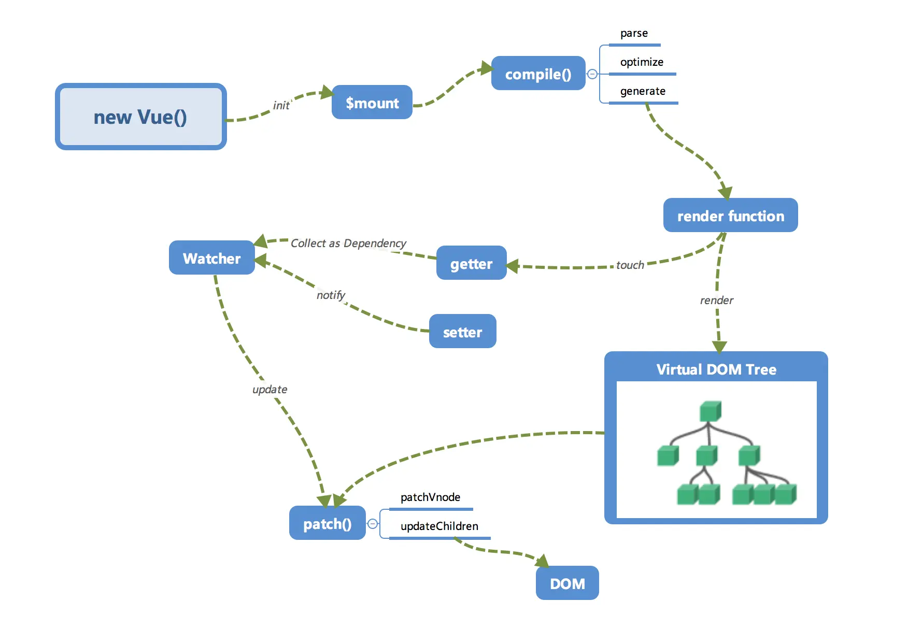
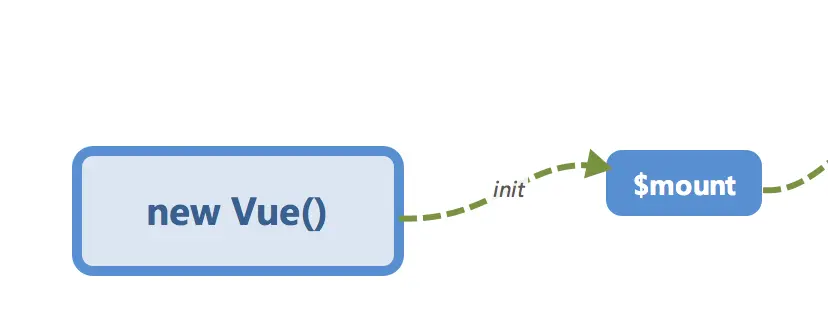
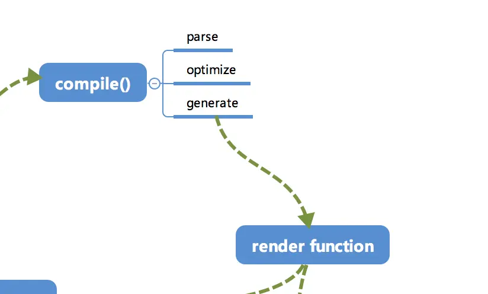
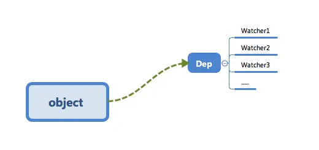
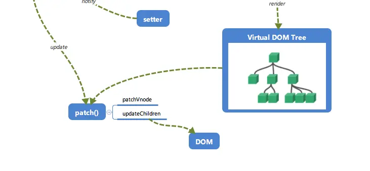

# Vue 运行机制全局概览

## 全局概览

内部流程图：

## 初始化及挂载

在 `new Vue()` 之后。 Vue 会调用 `_init` 函数进行初始化，也就是这里的 `init` 过程，它会初始化生命周期、事件、 props、 methods、 data、 computed 与 watch 等。其中最重要的是通过 `Object.defineProperty` 设置 `setter` 与 `getter` 函数，用来实现「**响应式**」以及「**依赖收集**」

初始化之后调用 `$mount` 会挂载组件，如果是运行时编译，即不存在 render function 但是存在 template 的情况，需要进行「**编译**」步骤。

## 编译

compile编译可以分成 `parse`、`optimize` 与 `generate` 三个阶段，最终需要得到 render function。

### parse

`parse` 会用正则等方式解析 template 模板中的指令、class、style等数据，形成AST。

### optimize

`optimize` 的主要作用是标记 static 静态节点，这是 Vue 在编译过程中的一处优化，后面当 `update` 更新界面时，会有一个 `patch` 的过程， diff 算法会直接跳过静态节点，从而减少了比较的过程，优化了 `patch` 的性能。

### generate

`generate` 是将 AST 转化成 render function 字符串的过程，得到结果是 render 的字符串以及 staticRenderFns 字符串。

在经历过 `parse`、`optimize` 与 `generate` 这三个阶段以后，组件中就会存在渲染 VNode 所需的 render function 了。

## 响应式

`getter` 与 `setter` 在 `init` 的时候通过 `Object.defineProperty` 进行了绑定，使得当被设置的对象被读取时会执行 `getter` 函数，而当被赋值修改的时候会执行 `setter` 函数。

当 render function 被渲染的时候，因为会读取所需对象的值，所以会触发 `getter` 函数进行「**依赖收集**」，「**依赖收集**」的目的是将观察者 Watcher 对象存放到当前闭包中的订阅者 Dep 的 subs 中。形成如下所示的这样一个关系。

在修改对象的值的时候，会触发对应的 `setter` ， `setter` 通知之前「**依赖收集**」得到的 Dep 中的每一个 Watcher，告诉它们自己的值改变了，需要重新渲染视图。这时候这些 Watcher 就会开始调用 `update` 来更新视图，当然这中间还有一个 `patch` 的过程以及使用队列来异步更新的策略

## Visual DOM

我们知道，render function 会被转化成 VNode 节点。Virtual DOM 其实就是一棵以 JavaScript 对象（VNode 节点）作为基础的树，用对象属性来描述节点，实际上它只是一层对真实 DOM 的抽象。最终可以通过一系列操作使这棵树映射到真实环境上。由于 Virtual DOM 是以 JavaScript 对象为基础而不依赖真实平台环境，所以使它具有了跨平台的能力，比如说浏览器平台、Weex、Node 等。

## 更新视图

当数据变化后，执行render function 就可以得到一个新的 VNode 节点，将这个 VNode 节点与旧的 VNode 节点进行 `diff` 算法，得到一个 `patch` 补丁，然后将这个补丁应用到旧的 VNode 节点上，就得到了一个新的 VNode 节点，然后将这个新的 VNode 节点渲染到真实的 DOM 上，就完成了视图的更新。

> 本文为学习[剖析 Vue.js 内部运行机制](https://juejin.cn/book/6844733705089449991)时的笔记