# patch机制

## 数据更新视图

当对 `model`(数据模型) 进行操作的时候，会触发对应 `Dep` 中的 `Watcher` 对象。`Watcher` 对象会调用对应的 `update` 来修改视图。最终是将新产生的 VNode 节点与老 VNode 进行一个 `patch` 的过程，比对得出「差异」，最终将这些「差异」更新到视图上。

## 跨平台

因为使用了 Virtual DOM 的原因，Vue.js具有了跨平台的能力，但是 Virtual DOM 终归只是一些 JavaScript 对象，要想调用不同平台的API，需要依赖一层适配层，将不同的API封装在内，以同样的接口对外提供。

例如：
```js
const nodeOps = {
    setTextContent (text) {
        if (platform === 'weex') {
            node.parentNode.setAttr('value', text);
        } else if (platform === 'web') {
            node.textContent = text;
        }
    },
    parentNode () {
        //......
    },
    removeChild () {
        //......
    },
    nextSibling () {
        //......
    },
    insertBefore () {
        //......
    }
}
```

## API

一些在 `patch` 过程中会用到的API，他们最终都会调用nodeOps中的相应函数来操作平台

- **`insert`**

`insert` 用来在 `parent` 这个父节点下插入一个子节点，如果指定了 `ref` 则插入到 `ref` 这个子节点前面。
```js
function insert (parent, elm, ref) {
    if (parent) {
        if (ref) {
            if (ref.parentNode === parent) {
                nodeOps.insertBefore(parent, elm, ref);
            }
        } else {
            nodeOps.appendChild(parent, elm)
        }
    }
}
```

- **`createElm`**

`createElm` 用来新建一个节点， `tag` 存在创建一个标签节点，否则创建一个文本节点。
```js
function createElm (vnode, parentElm, refElm) {
    if (vnode.tag) {
        insert(parentElm, nodeOps.createElement(vnode.tag), refElm);
    } else {
        insert(parentElm, nodeOps.createTextNode(vnode.text), refElm);
    }
}
```

- **`addVnodes`**

`addVnodes` 用来批量调用 `createElm` 新建节点。
```js
function addVnodes (parentElm, refElm, vnodes, startIdx, endIdx) {
    for (; startIdx <= endIdx; ++startIdx) {
        createElm(vnodes[startIdx], parentElm, refElm);
    }
}
```

- **`removeNode`**

`removeNode` 用来移除一个节点。
```js
function removeNode (el) {
    const parent = nodeOps.parentNode(el);
    if (parent) {
        nodeOps.removeChild(parent, el);
    }
}
```

- **`removeVnodes`**

`removeVnodes` 会批量调用 `removeNode` 移除节点。
```js
function removeVnodes (parentElm, vnodes, startIdx, endIdx) {
    for (; startIdx <= endIdx; ++startIdx) {
        const ch = vnodes[startIdx]
        if (ch) {
            removeNode(ch.elm);
        }
    }
}
```

## patch

### diff 算法

patch 的核心就是 diff 算法，通过 diff 算法可以对比出两棵树的「**差异**」

假设我们现在有如下两颗树，它们分别是新老 VNode 节点，这时候到了 `patch` 的过程，我们需要将他们进行比对。


diff 算法是通过 同层的树节点进行比较，而非对树进行逐层搜索遍历的方式，所以时间复杂度只有O(n)，是一种非常高效的算法。
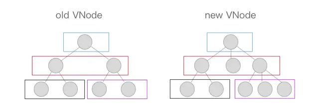

上图中相同颜色的方块中的节点会进行比对，比对得到「**差异**」后将这些「**差异**」更新到视图上。因为只进行同层级的比对，所以十分高效。

`patch` 过程简单代码：

```js
function patch (oldVnode, vnode, parentElm) {
    if (!oldVnode) {
        addVnodes(parentElm, null, vnode, 0, vnode.length - 1);
    } else if (!vnode) {
        removeVnodes(parentElm, oldVnode, 0, oldVnode.length - 1);
    } else {
        if (sameVnode(oldVNode, vnode)) {
            patchVnode(oldVNode, vnode);
        } else {
            removeVnodes(parentElm, oldVnode, 0, oldVnode.length - 1);
            addVnodes(parentElm, null, vnode, 0, vnode.length - 1);
        }
    }
}
```
因为 `patch` 的主要功能是比对两个 VNode 节点，将「**差异**」更新到视图上，所以入参有新老两个 VNode 以及父节点的 `element` 。

首先在 `oldVnode`（老 VNode 节点）不存在的时候，相当于新的 VNode 替代原本没有的节点，所以直接用 `addVnodes` 将这些节点批量添加到 `parentElm` 上。
```js
if (!oldVnode) {
    addVnodes(parentElm, null, vnode, 0, vnode.length - 1);
}
```

然后同理，在 `vnode`（新 VNode 节点）不存在的时候，相当于要把老的节点删除，所以直接使用 `removeVnodes` 进行批量的节点删除即可。
```js
else if (!vnode) {
    removeVnodes(parentElm, oldVnode, 0, oldVnode.length - 1);
}
```

最后一种情况，当 `oldVNode` 与 `vnode` 都存在的时候，需要判断它们是否属于 `sameVnode`（相同的节点）。如果是则进行 **patchVnode**（比对 VNode ）操作，否则删除老节点，增加新节点。
```js
if (sameVnode(oldVNode, vnode)) {
    patchVnode(oldVNode, vnode);
} else {
    removeVnodes(parentElm, oldVnode, 0, oldVnode.length - 1);
    addVnodes(parentElm, null, vnode, 0, vnode.length - 1);
}
```

### sameVnode

什么情况下两个 VNode 会属于 `sameVnode` （相同的节点）:
```js
function sameVnode () {
    return (
        a.key === b.key &&
        a.tag === b.tag &&
        a.isComment === b.isComment &&
        (!!a.data) === (!!b.data) &&
        sameInputType(a, b)
    )
}

function sameInputType (a, b) {
    if (a.tag !== 'input') return true
    let i
    const typeA = (i = a.data) && (i = i.attrs) && i.type
    const typeB = (i = b.data) && (i = i.attrs) && i.type
    return typeA === typeB
}
```
`sameVnode` 其实很简单，只有当 `key`、 `tag`、 `isComment`（是否为注释节点）、 `data`同时定义（或不定义），同时满足当标签类型为 input 的时候 type 相同（某些浏览器不支持动态修改`<input>`类型，所以他们被视为不同类型）即可。

### patchVnode

当新老VNode节点符合 `sameVnode` 条件，就会进行「**比对**」。
```js
function patchVnode (oldVnode, vnode) {
    if (oldVnode === vnode) {
        return;
    }

    if (vnode.isStatic && oldVnode.isStatic && vnode.key === oldVnode.key) {
        vnode.elm = oldVnode.elm;
        vnode.componentInstance = oldVnode.componentInstance;
        return;
    }

    const elm = vnode.elm = oldVnode.elm;
    const oldCh = oldVnode.children;
    const ch = vnode.children;

    if (vnode.text) {
        nodeOps.setTextContent(elm, vnode.text);
    } else {
        if (oldCh && ch && (oldCh !== ch)) {
            updateChildren(elm, oldCh, ch);
        } else if (ch) {
            if (oldVnode.text) nodeOps.setTextContent(elm, '');
            addVnodes(elm, null, ch, 0, ch.length - 1);
        } else if (oldCh) {
            removeVnodes(elm, oldCh, 0, oldCh.length - 1)
        } else if (oldVnode.text) {
            nodeOps.setTextContent(elm, '')
        }
    }
}
```

首先在新老Vnode节点相同的情况下，就不需要做任何改变了，直接 return 掉
```js
if (oldVnode === vnode) {
    return;
}
```

在当新老 VNode 节点都是 `isStatic`（静态的），并且 `key` 相同时，只要将 `componentInstance` 与 `elm` 从老 VNode 节点“拿过来”即可。这里的 `isStatic` 也就是前面提到过的「**编译**」的时候会将静态节点标记出来，这样就可以跳过比对的过程。
```js
if (vnode.isStatic && oldVnode.isStatic && vnode.key === oldVnode.key) {
    vnode.elm = oldVnode.elm;
    vnode.componentInstance = oldVnode.componentInstance;
    return;
}
```

接下来，当新 VNode 节点是文本节点的时候，直接用 `setTextContent` 来设置 text，这里的 `nodeOps` 是一个适配层，根据不同平台提供不同的操作平台 DOM 的方法，实现跨平台。
```js
if (vnode.text) {
    nodeOps.setTextContent(elm, vnode.text);
}
```

当新 VNode 节点是非文本节点当时候，需要分几种情况:
- `oldCh` 与 `ch` 都存在且不相同时，使用 `updateChildren` 函数来更新子节点 **(这个重点)**
- 如果只有 `ch` 存在的时候，如果老节点是文本节点则先将节点的文本清除，然后将 `ch` 批量插入插入到节点 `elm` 下。
- 同理当只有 `oldch` 存在时，说明需要将老节点通过 `removeVnodes` 全部清除。
- 最后一种情况是当只有老节点是文本节点的时候，清除其节点文本内容。
```js
if (oldCh && ch && (oldCh !== ch)) {
    updateChildren(elm, oldCh, ch);
} else if (ch) {
    if (oldVnode.text) nodeOps.setTextContent(elm, '');
    addVnodes(elm, null, ch, 0, ch.length - 1);
} else if (oldCh) {
    removeVnodes(elm, oldCh, 0, oldCh.length - 1)
} else if (oldVnode.text) {
    nodeOps.setTextContent(elm, '')
}
```

### updateChildren

函数代码：
```js
function updateChildren (parentElm, oldCh, newCh) {
    let oldStartIdx = 0;
    let newStartIdx = 0;
    let oldEndIdx = oldCh.length - 1;
    let oldStartVnode = oldCh[0];
    let oldEndVnode = oldCh[oldEndIdx];
    let newEndIdx = newCh.length - 1;
    let newStartVnode = newCh[0];
    let newEndVnode = newCh[newEndIdx];
    let oldKeyToIdx, idxInOld, elmToMove, refElm;

    while (oldStartIdx <= oldEndIdx && newStartIdx <= newEndIdx) {
        if (!oldStartVnode) {
            oldStartVnode = oldCh[++oldStartIdx];
        } else if (!oldEndVnode) {
            oldEndVnode = oldCh[--oldEndIdx];
        } else if (sameVnode(oldStartVnode, newStartVnode)) {
            patchVnode(oldStartVnode, newStartVnode);
            oldStartVnode = oldCh[++oldStartIdx];
            newStartVnode = newCh[++newStartIdx];
        } else if (sameVnode(oldEndVnode, newEndVnode)) {
            patchVnode(oldEndVnode, newEndVnode);
            oldEndVnode = oldCh[--oldEndIdx];
            newEndVnode = newCh[--newEndIdx];
        } else if (sameVnode(oldStartVnode, newEndVnode)) {
            patchVnode(oldStartVnode, newEndVnode);
            nodeOps.insertBefore(parentElm, oldStartVnode.elm, nodeOps.nextSibling(oldEndVnode.elm));
            oldStartVnode = oldCh[++oldStartIdx];
            newEndVnode = newCh[--newEndIdx];
        } else if (sameVnode(oldEndVnode, newStartVnode)) {
            patchVnode(oldEndVnode, newStartVnode);
            nodeOps.insertBefore(parentElm, oldEndVnode.elm, oldStartVnode.elm);
            oldEndVnode = oldCh[--oldEndIdx];
            newStartVnode = newCh[++newStartIdx];
        } else {
            let elmToMove = oldCh[idxInOld];
            if (!oldKeyToIdx) oldKeyToIdx = createKeyToOldIdx(oldCh, oldStartIdx, oldEndIdx);
            idxInOld = newStartVnode.key ? oldKeyToIdx[newStartVnode.key] : null;
            if (!idxInOld) {
                createElm(newStartVnode, parentElm);
                newStartVnode = newCh[++newStartIdx];
            } else {
                elmToMove = oldCh[idxInOld];
                if (sameVnode(elmToMove, newStartVnode)) {
                    patchVnode(elmToMove, newStartVnode);
                    oldCh[idxInOld] = undefined;
                    nodeOps.insertBefore(parentElm, newStartVnode.elm, oldStartVnode.elm);
                    newStartVnode = newCh[++newStartIdx];
                } else {
                    createElm(newStartVnode, parentElm);
                    newStartVnode = newCh[++newStartIdx];
                }
            }
        }
    }

    if (oldStartIdx > oldEndIdx) {
        refElm = (newCh[newEndIdx + 1]) ? newCh[newEndIdx + 1].elm : null;
        addVnodes(parentElm, refElm, newCh, newStartIdx, newEndIdx);
    } else if (newStartIdx > newEndIdx) {
        removeVnodes(parentElm, oldCh, oldStartIdx, oldEndIdx);
    }
}
```

首先定义 `oldStartIdx`、`newStartIdx`、`oldEndIdx` 以及 `newEndIdx` 分别是新老两个 VNode 的两边的索引，同时 `oldStartVnode`、`newStartVnode`、`oldEndVnode` 以及 `newEndVnode` 分别指向这几个索引对应的 VNode 节点。
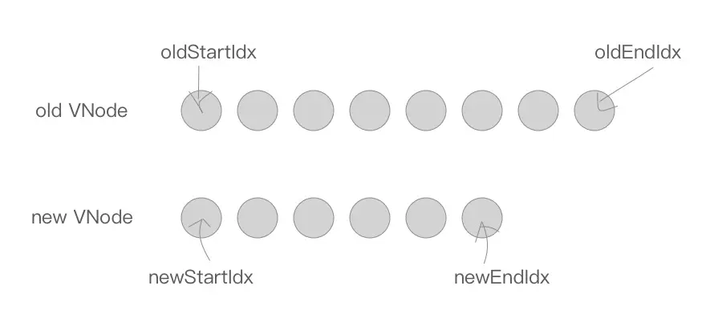

接下来是一个 `while` 循环，在这过程中，`oldStartIdx`、`newStartIdx`、`oldEndIdx` 以及 `newEndIdx` 会逐渐向中间靠拢。
```js
while (oldStartIdx <= oldEndIdx && newStartIdx <= newEndIdx) 
```
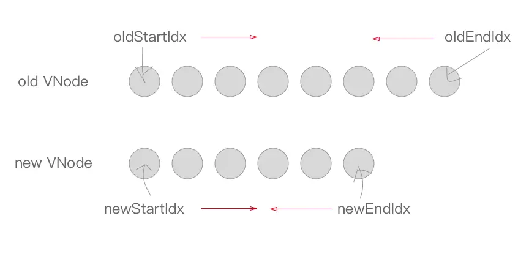

首先当 `oldStartVnode` 或者 `oldEndVnode` 不存在的时候，`oldStartIdx` 与 `oldEndIdx` 继续向中间靠拢，并更新对应的 `oldStartVnode` 与 `oldEndVnode` 的指向（注：下面的 `oldStartIdx`、`newStartIdx`、`oldEndIdx` 以及 `newEndIdx` 移动都会伴随着 `oldStartVnode`、`newStartVnode`、`oldEndVnode` 以及 `newEndVnode` 的指向的变化，之后的部分只会讲 `Idx` 的移动）。
```js
if (!oldStartVnode) {
    oldStartVnode = oldCh[++oldStartIdx];
} else if (!oldEndVnode) {
    oldEndVnode = oldCh[--oldEndIdx];
}
```

接下来这一块，是将 `oldStartNode`、`newStartVnode`、`oldEndVnode` 以及 `newEndVnode` 两两比对的过程，一共会出现 2*2=4 种情况。
```js
else if (sameVnode(oldStartVnode, newStartVnode)) {
    patchVnode(oldStartVnode, newStartVnode);
    oldStartVnode = oldCh[++oldStartIdx];
    newStartVnode = newCh[++newStartIdx];
} else if (sameVnode(oldEndVnode, newEndVnode)) {
    patchVnode(oldEndVnode, newEndVnode);
    oldEndVnode = oldCh[--oldEndIdx];
    newEndVnode = newCh[--newEndIdx];
} else if (sameVnode(oldStartVnode, newEndVnode)) {
    patchVnode(oldStartVnode, newEndVnode);
    nodeOps.insertBefore(parentElm, oldStartVnode.elm, nodeOps.nextSibling(oldEndVnode.elm));
    oldStartVnode = oldCh[++oldStartIdx];
    newEndVnode = newCh[--newEndIdx];
} else if (sameVnode(oldEndVnode, newStartVnode)) {
    patchVnode(oldEndVnode, newStartVnode);
    nodeOps.insertBefore(parentElm, oldEndVnode.elm, oldStartVnode.elm);
    oldEndVnode = oldCh[--oldEndIdx];
    newStartVnode = newCh[++newStartIdx];
} 
```

首先是 `oldStartVnode` 与 `newStartVnode` 符合 `sameVnode` 时，说明老 VNode 节点的头部与新 VNode 节点的头部是相同的 VNode 节点，直接进行 `patchVnode`，同时 `oldStartIdx` 与 `newStartIdx` 向后移动一位。
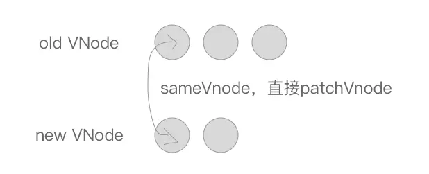

其次是 `oldEndVnode` 与 `newEndVnode` 符合 `sameVnode` ，也就是两个 VNode 的结尾是相同的 VNode，同样进行 `patchVnode` 操作并将 `oldEndVnode` 与 `newEndVnode` 向前移动一位。
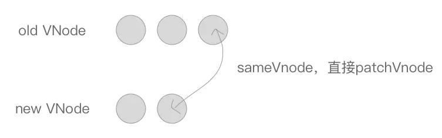

接下来是两种交叉的情况:

先是 `oldStartVnode` 与 `newEndVnode` 符合 `sameVnode` 的时候，也就是老 VNode 节点的头部与新 VNode 节点的尾部是同一节点的时候，将 `oldStartVnode.elm` 这个节点直接移动到 `oldEndVnode.elm` 这个节点的后面即可。然后 `oldStartIdx` 向后移动一位，`newEndIdx` 向前移动一位。
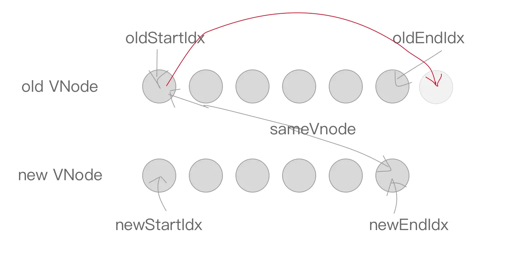

同理，`oldEndVnode` 与 `newStartVnode `符合 `sameVnode` 时，也就是老 VNode 节点的尾部与新 VNode 节点的头部是同一节点的时候，将 `oldEndVnode.elm` 插入到 `oldStartVnode.elm` 前面。同样的，`oldEndIdx` 向前移动一位，`newStartIdx` 向后移动一位。
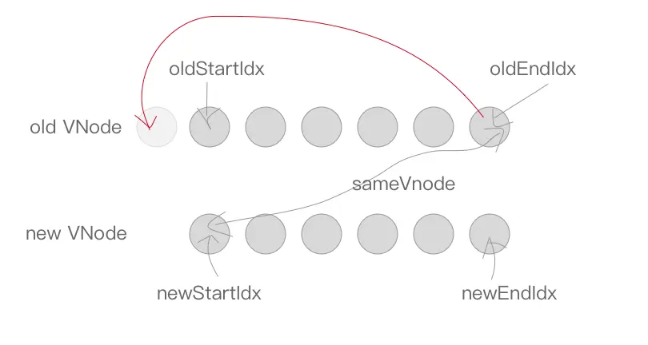


最后是当以上情况都不符合的时候，这种情况怎么处理呢？
```js
else {
    let elmToMove = oldCh[idxInOld];
    if (!oldKeyToIdx) oldKeyToIdx = createKeyToOldIdx(oldCh, oldStartIdx, oldEndIdx);
    idxInOld = newStartVnode.key ? oldKeyToIdx[newStartVnode.key] : null;
    if (!idxInOld) {
        createElm(newStartVnode, parentElm);
        newStartVnode = newCh[++newStartIdx];
    } else {
        elmToMove = oldCh[idxInOld];
        if (sameVnode(elmToMove, newStartVnode)) {
            patchVnode(elmToMove, newStartVnode);
            oldCh[idxInOld] = undefined;
            nodeOps.insertBefore(parentElm, newStartVnode.elm, oldStartVnode.elm);
            newStartVnode = newCh[++newStartIdx];
        } else {
            createElm(newStartVnode, parentElm);
            newStartVnode = newCh[++newStartIdx];
        }
    }
}

function createKeyToOldIdx (children, beginIdx, endIdx) {
    let i, key
    const map = {}
    for (i = beginIdx; i <= endIdx; ++i) {
        key = children[i].key
        if (isDef(key)) map[key] = i
    }
    return map
}
```

`createKeyToOldIdx` 的作用是产生 `key` 与 `index` 索引对应的一个 map 表。比如说：
```js
[
    {xx: xx, key: 'key0'},
    {xx: xx, key: 'key1'}, 
    {xx: xx, key: 'key2'}
]
```

在经过 createKeyToOldIdx 转化以后会变成：
```json
{
    key0: 0, 
    key1: 1, 
    key2: 2
}
```

我们可以根据某一个 `key` 的值，快速地从 `oldKeyToIdx`（`createKeyToOldIdx` 的返回值）中获取相同 `key` 的节点的索引 `idxInOld`，然后找到相同的节点。

如果没有找到相同的节点，则通过 createElm 创建一个新节点，并将 newStartIdx 向后移动一位。
```js
if (!idxInOld) {
    createElm(newStartVnode, parentElm);
    newStartVnode = newCh[++newStartIdx];
}
```

否则如果找到了节点，同时它符合 `sameVnode` ，则将这两个节点进行 `patchVnode` ，将该位置的老节点赋值 `undefined`（之后如果还有新节点与该节点key相同可以检测出来提示已有重复的 key ），同时将 `newStartVnode.elm` 插入到 `oldStartVnode.elm` 的前面。同理，`newStartIdx` 往后移动一位。
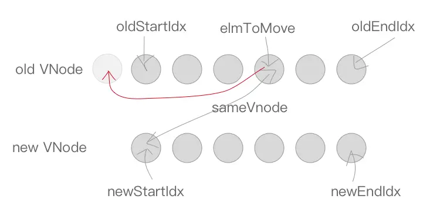

```js
else {
    elmToMove = oldCh[idxInOld];
    if (sameVnode(elmToMove, newStartVnode)) {
        patchVnode(elmToMove, newStartVnode);
        oldCh[idxInOld] = undefined;
        nodeOps.insertBefore(parentElm, newStartVnode.elm, oldStartVnode.elm);
        newStartVnode = newCh[++newStartIdx];
    }
}
```

如果不符合 `sameVnode`，只能创建一个新节点插入到 `parentElm` 的子节点中，`newStartIdx` 往后移动一位。
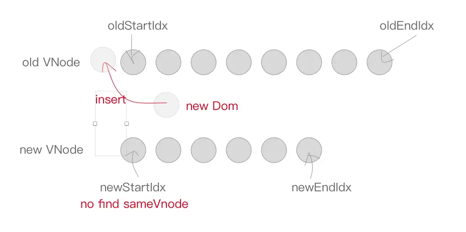
```js
else {
    createElm(newStartVnode, parentElm);
    newStartVnode = newCh[++newStartIdx];
}
```

最后一步就很容易啦，当 `while` 循环结束以后，如果 `oldStartIdx > oldEndIdx`，说明老节点比对完了，但是新节点还有多的，需要将新节点插入到真实 DOM 中去，调用 `addVnodes` 将这些节点插入即可。
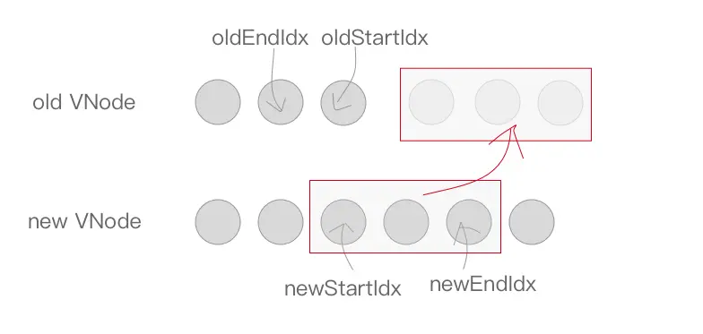

同理，如果满足 `newStartIdx > newEndIdx` 条件，说明新节点比对完了，老节点还有多，将这些无用的老节点通过 `removeVnodes` 批量删除即可。
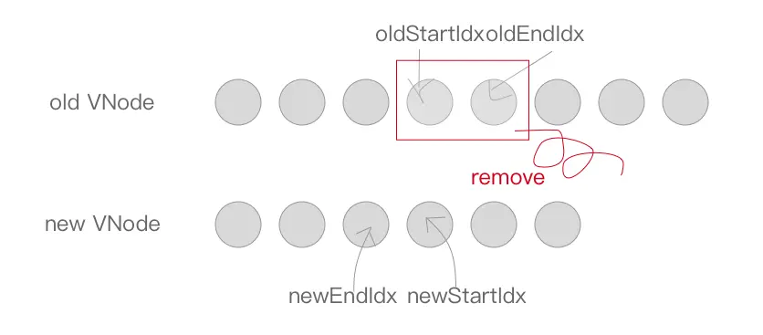

```js
if (oldStartIdx > oldEndIdx) {
    refElm = (newCh[newEndIdx + 1]) ? newCh[newEndIdx + 1].elm : null;
    addVnodes(parentElm, refElm, newCh, newStartIdx, newEndIdx);
} else if (newStartIdx > newEndIdx) {
    removeVnodes(parentElm, oldCh, oldStartIdx, oldEndIdx);
}
```

🎉🎉over!


> 本文为学习[剖析 Vue.js 内部运行机制](https://juejin.cn/book/6844733705089449991)时的笔记